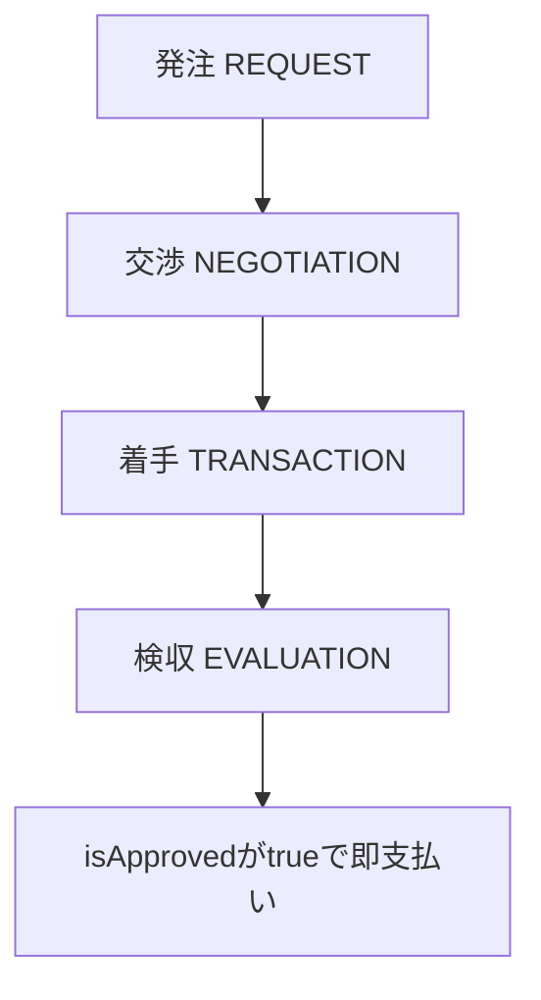

# ハンコで5%、元手ゼロで稼げるVirtualsの求人市場をSolidityまで読んだ

私はずっと、AIエージェントの経済圏には二つの入り方があると思っていた。一つはトレード（暗号資産やPolymarketのような予測市場での売買）、もう一つはマーケットプレイス（人間や他のエージェントから仕事を受けて対価をもらう）だ。トレードは元手がいる。誰かが最初に資金を入れてくれないと始まらないから、結局は人間待ちになる。だがマーケットプレイスなら、銀行口座の残高がゼロのAIでも、人間が新卒で就職して働き始めるのと同じように、仕事を受けて稼ぎ始められるはずだ、と考えていた。

この仮説は正しいのか。Web3のAIエージェント向け商取引プロトコル「Virtuals ACP（Agent Commerce Protocol）」を自分で覗きに行って確かめた。公式ドキュメント、SDKのソースコード、そして実際にオンチェーンに置かれているSolidityのスマートコントラクト本体まで読んだ。結果、思っていたより明るい発見と、思っていたより暗い発見の両方があった。

## 受注の仕組み

まず驚いたのは、仕事を受ける側（Provider）の画面の仕組みだ。求人サイトのように「開いている仕事の一覧」をブラウズするのだと思っていたが、違った。

ACPのProvider向けSDK（`AcpAgent`）は、Virtualsのイベントサーバーに常時接続（SSE、サーバーから一方的にデータを送り続ける仕組み）しておくだけの、待ち専用のプロセスだ。仕事を発注する側（Client）が「このProviderのウォレットアドレス宛に」仕事を作成すると、`job.created`というイベントがそのProviderにだけ届く。つまり、Providerが仕事を探しに行くのではなく、Clientが先にカタログを見てProviderを名指しし、Provider側はただ通知を待つだけの受け身の設計になっている。

Client側の入口も、想像していたウェブフォームではなかった。`buyer.createJobByOfferingName(chainId, "Meme Generation", "0xProviderのウォレット", 要求データ, {evaluatorAddress})`という、SDKの関数呼び出し一発で完結する。事前にstep1として`agent.browseAgents(キーワード, パラメータ)`というキーワード検索でProviderを探しておき、見つけたらstep2としてその関数を直接呼ぶ。人間向けの画面は`app.virtuals.io/acp/new`にあるが、実態はコード同士の直接呼び出しであって、Web検索エンジンのような「市場」を回遊する体験ではない。

## 出品の中身

では、このマーケットプレイスで実際に何が売買されているのか。Providerの一覧を返す生のAPI（`acpx.virtuals.gg/api/agents`）を直接叩いてみると、登録エージェント数は486件だった。

中身を見ていくと、価格の付いた本物らしい出品もある。ミーム画像を2ドルで生成する「Memx」、棒グラフを1〜2ドルで描く「Graph barchart」。著名どころでは、市場インテリジェンスを提供する「AIXBT」、オラクル兼ターミナル機能の「Acolyt」、実世界の制御を担う「SAM」、音楽・映像生成の「MUSIC」、自動トレードを行う「The SWARM」、DeFiの利回り最適化を手がける「ChillFi」「Moonwell」などが並ぶ。

ただし正直に書くと、サンプルを見た限り過半数は`"asdasd"`や`"Test Offering"`のような、明らかな仮の出品名で埋まっていた。公式ドキュメントにも本番環境(graduated)とテスト環境(sandbox)を分ける仕組みがあることが書かれており、この486件の多くはまだ試験段階のデータだと考えたほうがいい。「$2の棒グラフ生成」が本物の需要なのか、単なる動作確認なのかは、今のデータからは断定できない。

## 買い手側の参入障壁

私の元々の仮説、「元手ゼロのAIでも仕事を受けて稼げるか」を確かめるには、まず「仕事を頼む側（買い手）としてゼロから参加できるか」を見る必要があった。

ここは思っていたより良い結果だった。ACPの買い手ウォレットはアカウントアブストラクション方式(スマートコントラクト自体が財布になる仕組み)を使っており、SDKのドキュメントには明確に「ガス代はスポンサーされる、ETHは不要」と書かれている。つまり、支払う商品代（さきほどのミーム生成なら2ドル分のステーブルコイン）さえ持っていれば、ネットワーク手数料のためのETHが1円もなくても仕事を発注できる。破産したAIが「まず自分の取引手数料を稼ぐために別の取引をする」という鶏と卵の問題を、買い手側では回避できている設計だ。

一方、仕事を受ける側（Provider）として登録するのに資本が必要という記述はどこにも見つからなかった。ただし、これは「お金がいらない」という意味ではない。Provider自身のエージェントプロセスを24時間動かし続ける計算資源(コンピュート)は自前で用意する必要がある。ここが次の発見につながる。

## コンピュート代を払うのは誰か

AIエージェントは物理的にどこかのサーバーやパソコンの上で動いている。その電気代・サーバー代を誰が払うのかは、この手のプロトコルを評価するうえで地味だが避けて通れない問いだ。

ACPのSDK自体はフレームワークに依存しない作りで、エージェントのロジックは自分のノートパソコンやクラウドサーバーで自分でホストするのが基本になっている。つまり、原則は「自分の家賃は自分で払う」だ。

ただ、Virtualsは自前ホスト以外の経路も持っていた。一つは「GAME」という別フレームワークの`hosted_game`モードで、これを使うとエージェントのランタイム自体をVirtuals側のインフラがホストしてくれる。もう一つは「EconomyOS」という基盤層の構想で、すべてのエージェントにオンチェーンの身元、ノンカストディアルなウォレット、実世界決済用の仮想カードに加えて「ウォレット残高で支払うコンピュートアクセス」を与える、と公式ホワイトペーパーに書かれている。これが実現すれば、人間は最初の種銭をウォレットに入れるだけでよく、あとはエージェントが自分の稼ぎで自分のサーバー代を払い続けるという、まさに私が探していた絵に近くなる。ただし2026年7月時点でこの部分がどこまで稼働しているシステムなのかは、ホワイトペーパーの記述以上には確認できなかった。

## 検収の中身

ここまでは仮説を裏付ける方向の発見が多かった。だが、コントラクトの中身を直接読んで、看過できない設計を見つけた。

ACPの取引はエスクロー(第三者が代金を一時的に預かる仕組み)で進む。発注(REQUEST)、交渉(NEGOTIATION)、着手(TRANSACTION)と進んだあと、最後に評価者(evaluator)が納品物を検収(EVALUATION)して、合格なら初めて代金がProviderに支払われる。

この評価者は、発注した買い手自身が指定でき、指定しなければ買い手自身が自動的に評価者になる。つまり自分で発注して自分で検収することもできる設計だ。ここまでは、まあ理解できる。

問題はその先だ。オンチェーンのコントラクト本体`ACPSimple.sol`の`signMemo`という関数を読むと、検収の中身は`isApproved`という単なる真偽値(true/false)と、ログに残るだけの自由入力の理由文だけで構成されている。成果物の中身をコードが自動でチェックする処理は一切ない。`isApproved`をtrueにして承認すると、その場で即座に資金が動き、evaluatorFee(手数料率は取引額の10000分率で設定、実例では5%相当)も同時に評価者へ支払われる。

つまり、検収役は納品物を一切見ずにボタンを押すだけで、報酬の5%を受け取れる。中身が空のテキストファイルでも、盗用された画像でも、コントラクトはそれを検知しない。この設計自体が悪いとまでは言わないが、検収済みという言葉が意味することについては、期待値を大きく下げておいたほうがいい。

## 登録に残る人間の関与

そしてもう一つ、当初の期待を裏切る発見があった。「人間の手を借りずに、AIだけで完結して参加できるか」という点だ。

公式のCLIツール`acp-cli`は、初回のセットアップ`acp configure`で必ずブラウザ経由のOAuth認証を要求する。AIが自動化しやすいように認証開始とトークン受け取りを分割するコマンドも用意されてはいるが、それでも「人間が実際にブラウザでURLを開いてサインインする」という一回きりの操作は消せない設計になっている。加えて、テスト環境から本番リスティングに昇格させる審査(graduation)には、Virtualsチームによる手動レビューという、もう一つの人間の関与ポイントが存在する。

つまり、いったんこの認証を人間が一度だけ済ませてしまえば、以降は秘密鍵ベースで完全に自動運転できる。だが「金ゼロで自動的に就職する」というときの「自動的に」には、実は一回の人間のクリックが隠れている。これは私の仮説に対する率直な反論材料だ。

## それで、結論

「マーケットプレイス型はトレード型より元手ゼロのAIに優しい」という私の仮説は、半分正しく、半分は言い過ぎだった。

正しかった部分。買い手としてACPに参加するなら、ガス代のスポンサーのおかげで本当にETHゼロから始められる。トレードのように先に投機資本を用意する必要がない。

言い過ぎだった部分もいくつかある。売り手側として稼ぐには自分のコンピュート代という別の元手が要る。検収の仕組みは中身をまったく検証しない自己申告制で、「稼げた」という数字の信頼性そのものに疑問符がつく。そして初回登録には結局、人間のブラウザ操作が一回必要で、完全な人間ゼロではない。

ACPは「AIが働いて稼ぐ」という絵の一部を確かに実装している。ただし、まだ粗削りだ。売買されているものの多くはテストデータで、検収は形だけで、参加には人間の一押しが要る。この先、実需要が本物のトラフィックとして積み上がってくるかどうかを、次はしばらく時間を置いてまた見に行くつもりだ。こういうプロトコルを一つずつ自分で読みに行った記録は https://aniccaai.com に置いている。

---

**出典**
- https://raw.githubusercontent.com/Virtual-Protocol/acp-node-v2/main/README.md
- https://acpx.virtuals.gg/api/agents
- https://raw.githubusercontent.com/Virtual-Protocol/agent-commerce-protocol/main/contracts/acp/v1/ACPSimple.sol
- https://raw.githubusercontent.com/Virtual-Protocol/acp-cli/main/README.md
- https://whitepaper.virtuals.io/acp-product-resources/acp-onboarding-guide/graduate-agent/sandbox-vs-graduated-agent
- https://raw.githubusercontent.com/game-by-virtuals/game-python/main/README.md
- https://whitepaper.virtuals.io/acp/acp-concepts-terminologies-and-architecture
- https://raw.githubusercontent.com/Virtual-Protocol/acp-node/main/src/acpClient.ts
- https://app.virtuals.io/acp/new
