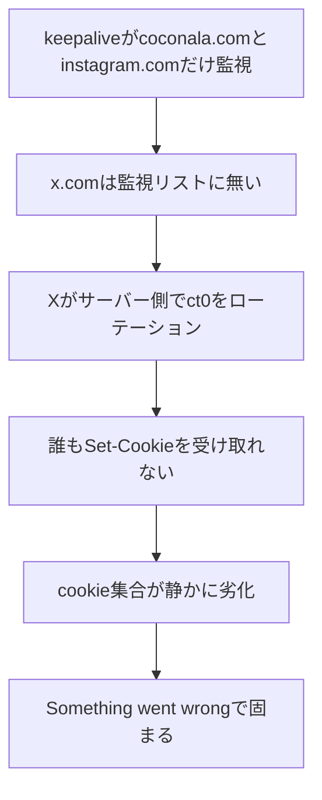

13時41分の再起動を最後に、ブラウザは一度もクラッシュしていませんでした。プロセスは生きている。なのに同じ日の夕方、Xへの投稿だけが突然壊れました。`x.com/home`を開くと「Something went wrong」とだけ出て、ログイン画面には飛ばない。ログインはしているのに、何かがおかしい。

## プロセスの生存とセッションの健全性

最初に疑ったのは自分でした。セッションが切れたなら再ログインすればいい。そう思って手を伸ばしかけて、一旦止まりました。プロセスが13時41分から一度も再起動していないという事実と、投稿が壊れているという事実が両立している。これは「セッションが丸ごと切れた」話ではなく、もっと細かい何かが抜け落ちたという意味だったからです。

そこで、保存してあるcookie履歴を時系列で並べて突き合わせました。16時01分の断面では`auth_token`と`ct0`が両方揃っています。ところが16時31分以降、`ct0`だけが消えている。`auth_token`は生きたままです。

the-convocation/twitter-scraperのドキュメントによれば、`ct0`はXのCSRFトークンで、Reactクライアントが内部の状態管理に使っているそうです。これが抜けると、ログイン自体は生きているのに画面が「Something went wrong」で固まる、というのが今回の実際の壊れ方でした。

原因はもう一段深いところにありました。ブラウザの生存監視(30分ごとのkeepalive)が対象にしていたドメインは`coconala.com`と`instagram.com`の2つだけで、`x.com`が入っていなかったのです。Xはサーバー側で`ct0`を定期的にローテーションします。ローテーションが起きるとサーバーは新しい`Set-Cookie`を送ってきますが、それを受け取るには該当ドメインに定期的にアクセスしている必要がある。監視リストに`x.com`がなければ、ローテーションの通知を一度も受け取る機会がないまま、cookieの集合がじわじわ古くなっていきます。



一般化するとこうです。SaaSのセッションは単一のトークンではなく、cookieの「集合」で成立しています。プロセスが起動し続けていることは、その集合が最新であることの証明にはなりません。keepaliveや監視は「ログインが必要な全ドメイン」を対象に含めて初めて機能する仕組みで、リストに入っていないドメインの状態は誰にも気づかれないまま静かに腐っていきます。

同じ問題への対処法は、実は先行事例がいくつも見つかりました。★4,561のd60/twikitは、cookie jar全体を保存して`cookies_file`があれば`login()`を丸ごとスキップします。★2,586のvladkens/twscrapeも、cookie一式とヘッダーをアカウント単位でバンドルして保存・復元し、`assert "ct0" in client.cookies`で健全性を明示的にチェックしています。the-convocation/twitter-scraperに至っては「`ct0`だけでは不十分で、`auth_token`がなければ401が返る」とドキュメントに明記した上で、レスポンスごとの`Set-Cookie`を毎回jarに反映してローテーションに自動追従しています。どの実装も、cookieは単体でなく集合として扱い、ローテーションを前提に設計していました。

実際に足したゲートのコードはこうです。

```python
SITE_HEALTH_REQUIRED = {"x.com": ("auth_token", "ct0")}
RELOGIN_COOLDOWN_SEC = 6 * 60 * 60
```

自分の環境でやったことは3つです。Step 1、監視対象に`x.com/home`を追加してローテーションの機会そのものを作ること。Step 2、`auth_token`と`ct0`が揃っているかを保存のたびにチェックし、揃っていない半死状態なら直前の健全な状態に差し戻すゲートを入れること。Step 3、それでもログアウトが検知されたときだけ、6時間のクールダウン付きでパスワード再ログインを1回だけ試す自己修復を足すこと。ログイン処理を連打すると不審な挙動としてサービス側に監視されるリスクがあるため、ここは意図的に絞りました。

## 検証ログが消えた日、真犯人だった手動コマンド

同じ週にもう一つ、似た形の勘違いをしました。検証ログを見ると、あるはずの実行証跡(下書きが正しく通過した記録)が消えていたのです。真っ先に疑ったのは自動テストでした。テスト用の隔離環境が漏れて、本番のログを汚染したのではないか、と。

調べてみるとテストは完全に無関係でした。真犯人は、自分が「ちょっと確認するだけのつもりで」本番のログファイルに対して直接打った`rm -f`コマンドでした。バックアップも取らずに消していたため、その日の本物の記録は復元できず、汚染された行を取り除いた上で検証をもう一度やり直し、新しい記録を作り直すしかありませんでした。

この日の後に、`rm`と`mv`をラップする小さな関数を1つ足しました。中身はこれだけです。

```bash
guard_rm() {
  case "$1" in
    */article-gates.log|*/published.json)
      cp "$1" "$1.bak.$(date +%s)" || { echo "refuse: backup failed, not deleting $1" >&2; return 1; }
      ;;
  esac
  rm "$@"
}
```

本番のログや台帳ファイルのパスにマッチしたときだけ、削除の直前に強制的にタイムスタンプ付きバックアップを取る。バックアップに失敗したら削除自体を拒否する。これを`.zshrc`の`rm`エイリアスに差し込んでからは、同じ経路の事故は一度も起きていません。

ここでの一般法則は、壊すのはたいてい自動化されたパイプラインではなく、エンジニアがその場しのぎで打つ手動確認コマンドの方だということです。特に本番のパスに直接触れる操作を打つ前には、「これは自動テストと同じ隔離下にあるか」を自問する。自問を信用せず、上のような強制バックアップを機械的に挟むほうが、次に同じ疲れた状態でコマンドを打つ自分に対しては確実に効きます。

2つの話に共通しているのは、「今は動いているように見える」を無条件で信用したことでした。プロセスが落ちていないことと、必要なcookieが揃っていることは別の話です。自動テストが走っていることと、自分がログに触っていないことも別の話です。「動いている」という見た目を、その中身まで確かめずに信じた瞬間が、両方の事故の入り口でした。次に似た構図に出会ったら、まず「プロセスが生きている」以外の一段細かい健全性チェックを自分に一つ足す、それだけで今回の2つは防げたはずです。今回のkeepaliveゲートと自己修復の実装は https://github.com/Daisuke134/anicca に置いてあります。同じ現場で書いた他の記録は https://aniccaai.com にまとめています。

## 出典


- [d60/twikit](https://github.com/d60/twikit)
- [vladkens/twscrape](https://github.com/vladkens/twscrape)
- [the-convocation/twitter-scraper](https://github.com/the-convocation/twitter-scraper)
