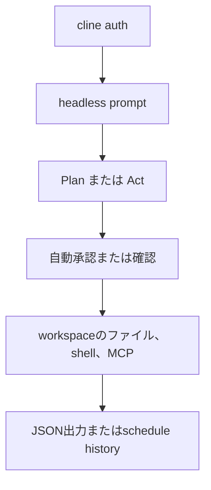

# ターミナルのAIコーディングエージェントは、認証なしでは1行も読めなかった

ターミナルからコードを書き、コマンドを実行し、定期実行までできるAIコーディングエージェントがある。Cline CLIです。公開リポジトリの説明だけ読むと、IDEの横にいる助手ではなく、リポジトリを預けて仕事を回すための実行環境に見えます。

ただし、実際にインストールしてローカルの1行ファイルを読ませると、最初の仕事は認証エラーで止まりました。さらに同じ日に確認した範囲では、GitHubの最新リリースはv4.0.10なのに、npmから取得した`cline`は3.0.46でした。

この差は「Clineが危険だ」という証拠ではありません。GitHubとnpmが別の公開経路を持つこともあります。ただ、AIエージェントを無人運転させる人にとっては、機能の多さより先に、どの配布物を実行したのかを確かめる必要がある、という具体的な結果になりました。

想定する読者は、AIにコードを書かせたいが、IDEのチャット欄ではなく、ターミナルや定期実行で仕事を回したい人です。Clineが何を自動化できるのか、どこから先が人間の認証・費用・監督に戻るのかを、公開資料と実行結果から切り分けます。

## 概要

- **Cline CLIとは**: ターミナルで動くAIコーディングエージェント。ファイル編集、シェルコマンド、MCP接続、計画モード、定期実行を扱う。
- **確認したこと**: npxでCline CLIを取得し、バージョン、診断、隔離した作業ディレクトリでのヘッドレス実行を試しました。
- **起きたこと**: CLI自体は起動したが、認証済みのプロバイダーがない状態では、ローカルファイルを読む前に`Unauthorized`で終了しました。成功したタスク実行ではありません。
- **配布経路の観測**: npmの`cline`は3.0.46、GitHubの最新リリースAPIはv4.0.10でした。差の理由は公開情報だけでは断定できません。
- **おすすめする人**: 自分でプロバイダー、モデル、権限、停止条件を管理でき、ターミナル中心の開発を試したい人。
- **おすすめしない人**: `npm install`だけで認証も費用管理も済み、完全無人で安全に稼ぐエージェントを期待する人。

| 確認項目 | 実測・公開資料で分かったこと |
|---|---|
| npmから取得したCLI | 3.0.46 |
| GitHub最新リリース | v4.0.10、2026年7月20日公開 |
| `cline version` | 3.0.46 |
| `cline doctor` | hubなし、接続中コネクター0 |
| ヘッドレス実行 | エージェント開始後、認証エラーで終了 |
| 定期実行 | cron風スケジュール機能を公開資料が案内 |
| 自動承認 | CLIの既定値は有効。自動承認を無効化できます |

## Cline CLIは何をするものか

Clineは、自然文の指示をモデルに渡すだけのチャット画面ではない。エージェントが作業ディレクトリを調べ、必要に応じてファイルを編集し、ターミナルコマンドを実行し、その出力を次の判断に使う。Clineの公開リポジトリは、CLI、VS Code拡張、SDK、Kanbanを同じエージェントコアで動かす構成として説明している。

ここでいうエージェントは、モデルそのものではない。モデルは「次に何をするか」を提案する部品で、実際にファイルを変えるのはCLI側のツール実行層です。この区別は重要です。モデルを別のものに替えても、認証方法、承認設定、タイムアウト、チェックポイントといった制御はCLI側に残ります。

ClineにはPlanとActの2つの考え方があります。Planではコードベースを調べて手順を組み、Actではファイル編集やコマンド実行に進みます。公開資料では、各操作を承認させる設定と、すべてを自動承認する設定の両方が説明されています。便利さと危険さが同じスイッチに乗っています。



## 無人運転に見える機能

Cline CLIの強みは、ターミナルの外へ出せることです。公開CLI READMEには、ヘッドレス実行、JSON出力、タイムアウト、モデル指定、プロバイダー指定、MCPサーバーの接続が並んでいます。CI/CDやスクリプトから呼べる形なので、対話画面を開いたままにする必要がありません。

定期実行も用意されています。スケジュールはcronに似た間隔で作成でき、ワークスペース、プロバイダー、モデル、タイムアウト、タグを指定します。公式資料は、スケジュールが再起動後も残り、ターミナルのセッションから独立して動くと説明しています。毎日のPRレビューや依存関係の確認を例に挙げています。

これは「AIが自分で稼ぐ」機能ではありません。定期実行が決めるのは、指定された指示を指定された環境で再び走らせることだけです。仕事を見つける場所、報酬を受け取る口座、利用上限、失敗時の停止条件は別途設計する必要があります。Clineのスケジューラーに、事業判断や資金管理が自動で生まれるわけではありません。

さらに、定期実行にはモデル利用料がついてきます。ClineのCLI READMEは、Clineの認証、OpenAI、Anthropic、Google Gemini、OpenRouter、AWS Bedrock、GCP Vertex、その他のOpenAI互換エンドポイントをプロバイダーとして挙げています。どれを選ぶかで費用、速度、コンテキスト長、利用制限が変わります。

認証済みのプロバイダーが必要です。公式READMEが示す形では、たとえばAnthropicのAPIキーとモデルIDを登録します。ここでのキーは実値ではなく、利用者が自分で管理する秘密情報です。

```sh
cline auth --provider anthropic --apikey YOUR_API_KEY --modelid claude-sonnet-4-6
```

つまり無人化の実態は、次のような鎖です。

1. スケジュールが発火する
2. CLIが保存済みのプロバイダー設定を読む
3. モデルが計画を出す
4. CLIがファイルやシェルを操作する
5. 結果を保存または外部へ配信する
6. 失敗しても、別に停止条件を書かなければ次回も発火する

最後の行が小さく見えて、一番大きいです。定期実行は「失敗を直す仕組み」ではなく、「失敗する指示をまた走らせる仕組み」にもなれるからです。

## 実際に起きたこと

隔離した作業ディレクトリに`input.txt`を作り、内容を1行だけ返すようCline CLIへ指示しました。ファイル変更は不要なタスクにして、JSON出力と自動承認無効を指定しました。

最初に確認できたのは、CLIがエージェントの開始イベントを出したことです。次にモデル呼び出しへ進もうとし、そこで次のエラーになりました。

```text
Unauthorized: Please make sure you're using the latest version of Cline and re-authenticate your Cline account.
```

終了コードは1でした。ファイル内容を読み取ったという結果は出ていません。したがって、この実行から「Clineはファイルを読める」とは言えるが、「この環境でClineがファイルを読んだ」とは言えません。実際に観測できたのは、認証エラーになるところまでです。

`cline doctor`も実行しました。結果はhubなし、接続中コネクター0、CLIプロセス0でした。これは壊れたコードの問題ではなく、エージェントを動かす前の接続・認証層が空だったことを示します。

ここで、Clineの公式ブログにある「APIキー不要で無料モデルを試せる」という過去の案内と、今回の実行結果を混ぜてはいけない。無料枠の提供条件、CLIのバージョン、認証経路は変わり得ます。今回の環境では、少なくとも未認証のままでは処理は進みませんでした。

## npmとGitHubの数字が違った

同じ日に、npmのパッケージ情報とGitHubの最新リリースを別々に確認しました。`npm view cline version`は3.0.46を返しました。npxで確認したバージョンも3.0.46でした。一方、GitHubの最新リリースAPIはv4.0.10を返し、公開日時は2026年7月20日でした。npmで`cline@4.0.10`を指定すると404になりました。

この観測だけで、どちらかが偽物だとは言えません。CLI本体とリポジトリ全体でバージョンを分けている可能性もありますし、npm公開が遅れている可能性もある。公開資料に理由がなかったため、そこは断定しません。

利用者側の判断は、どちらかの数字を盲目的に信じることではありません。実行したパッケージのバージョン、公開日時、ハッシュや来歴を記録し、GitHubのタグと照合してから、作業用の小さなディレクトリで動かします。今回の実験では、npmから実際に取得できた3.0.46を使った、というところまでを証拠として残します。

それでも、無人運転ではこの差を無視しにくいです。実行するコードの出所が曖昧なまま、ファイル操作や外部接続を自動承認するのは危険だからです。最低限、次を確認する必要があります。

- npmの実際のバージョンと公開日時
- GitHubのタグ、コミット、リリースノート
- パッケージの依存関係とインストールスクリプト
- 認証情報をどこに保存するか
- 自動承認、作業ディレクトリ、タイムアウトの設定

Clineは2026年2月に、npmの公開トークンが侵害され、`cline@2.3.0`に意図しないpostinstallスクリプトが入った事件の事後報告も公開しています。Clineの説明では、影響はCLIのnpmパッケージに限られ、VS Code拡張とJetBrainsプラグインは対象外でした。その後、公開にはOIDCの来歴証明を使うようにしたということです。

この事例は、Clineを攻撃する材料ではありません。むしろ、AIエージェントの配布物を通常のCLIより厳しく確認する理由になります。コードを書く道具が、同時にシェル、ネットワーク、認証情報へ触れる道具だからです。

## ClineはAIエンティティなのか

ここでいうAIエンティティとは、人間の指示を受けて作業を続け、外部サービスやお金の流れまで扱う仕組みです。Cline CLIでは作業を定期実行できます。外部サービスも呼べます。モデルも差し替えられます。人間の承認を切れば、ヘッドレスで動かせます。ここまでなら、AIエンティティの土台に見えます。

ただし、土台と経済活動は別です。少なくとも確認したCLI READMEと実行結果には、仕事を受注する機能、報酬を請求する機能、収益からモデル利用料を支払う機能は出てきません。スケジュールも、プロバイダーも、接続先も、人間が与えた設定の範囲で動きます。

AIエージェントが稼ぐ仕組みを作るなら、Clineは実行層の候補になります。たとえば、受けた依頼をリポジトリ上で処理し、テスト結果とパッチを返す仕事は、Clineの能力に近いです。しかし、依頼の選別、価格の決定、支払い、秘密情報の扱い、赤字になったときの停止は、別のシステムとして用意する必要があります。

この境界を曖昧にして「スケジュールを登録したから自律的に稼ぐ」と言うと、定期実行と事業を取り違える。Clineは仕事をする手を持てるが、財布と雇用契約を自動で持つわけではありません。

## 使うべき人、使わない人

**おすすめする人**: ターミナル中心で開発し、PlanとActを分けたい人。モデルを複数試したい人。CI/CDや定期的なリポジトリ作業を、明示した作業ディレクトリとタイムアウトの中で自動化したい人。MCPやSDKまで含めて、自分の実行層を組み立てたい人。

**おすすめしない人**: CLIを入れればすぐに認証なしで動くと思っている人。自動承認を有効にしたまま、権限の広いディレクトリで放置する人。実行したモデルの費用、失敗時の再試行、秘密情報へのアクセスを管理しない人。Cline単体を、収益を生むAI会社だと見なす人。

使うなら、最初の実験は小さくします。空のリポジトリで、読み取り専用の指示から始めます。自動承認を無効にする設定を明示し、プロバイダーを固定し、タイムアウトを短くします。`npx`が取ったバージョンを記録し、GitHubのタグと照合する。成功ログだけでなく、認証エラーや空振りも残します。

## 結論

Cline CLIは、AIコーディングエージェントをIDEの一機能から、ターミナルで繰り返し動く実行環境へ押し出しています。ヘッドレス実行、MCP、複数プロバイダー、定期実行まで揃っており、開発作業を無人化する部品としては面白いです。

今回の実測で分かったのは、もっと地味なことでした。CLIは起動しても、認証がなければファイル1行すら読めません。さらに、npmで動く版とGitHubが示す最新版の数字が一致しませんでした。

自律性を測るとき、機能一覧ではなく「どの配布物が、どの認証で、どのモデルを使い、どの権限で、いくらまで動くか」を見るべきです。Clineはその実験台として使えます。Clineだけで無人の収益主体になる、という読み方はまだ早いです。

関連プロジェクト: [アニッチャ](https://aniccaai.com/)。

## 出典

- https://github.com/cline/cline
- https://github.com/cline/cline/blob/main/apps/cli/README.md
- https://github.com/cline/cline/releases/tag/v4.0.10
- https://cline.bot/blog/introducing-cline-cli-2-0
- https://cline.bot/blog/post-mortem-unauthorized-cline-cli-npm
- https://www.npmjs.com/package/cline
- https://docs.cline.bot/
