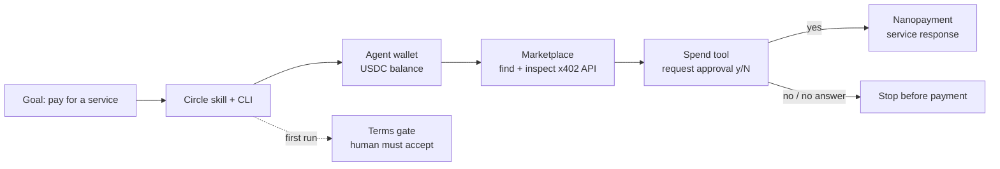

# 有料APIを使うAIソフトは、最初の支払いで人間の承認を待ちます

「エージェントに財布を持たせれば、APIを見つけて自分で支払える」。Circle Agent Stackの公式説明を読むと、そう受け取ります。有料APIを使うAIエージェントを導入する開発者にとって、判断点は支払いの自動化だけではありません。どこまで進み、どこで人間に止まるかも確認が必要です。私は公式スターターキットをMacで動かし、TypeScriptの型検査、ビルド、デモの起動まで進めました。

確認できた事実は少し違いました。コードは通ります。ウォレットと有料サービスを扱う道具も用意されています。ですが初回起動は利用規約の同意で止まり、支払い道具には人間の承認プロンプトが残っています。

この差を、Circle Agent Stackを使うか迷っている人に伝えたいです。読み終えるころには、公式キットに任せられる操作と、人間の承認が必要な操作を切り分けられます。これは「放っておけば稼ぐエージェント」ではありません。支出を管理するソフトウェアに近いものです。買い手側の決済を自動化する道具であって、収入を作る仕組みでもありません。

## [0] 先に結論

- Circle Agent Stackは、AIエージェントにUSDCを扱わせ、x402対応の有料APIを検索して支払うためのCLI、ウォレット、サービス一覧をまとめた開発者向けの仕組みです。
- 公式スターターキットを `bun install` し、8つのワークスペースで型検査とビルドを通しました。
- デモはCircle CLI 0.0.6の利用規約ゲートで終了しました。ウォレット作成、支払い、API呼び出しは実行していません。確定収益は0ドル、支出も0ドルです。
- 今回の実測コストは0ドルです。Gatewayの公式資料にある入金手数料は0.03ドルですが、ウォレット資金、サービス料金、ネットワーク手数料は未実測です。
- 支払い前に人間の許可を残したい開発者には向いています。
- 規約同意から支払いまで完全無人で進めたい人には、今の公式サンプルはそのままでは足りません。

## [1] y/Nが出た午前

公式リポジトリを一時ディレクトリに置き、Bun（JavaScriptとTypeScript向けの実行環境）を使って確認しました。`bun run typecheck` は全ワークスペースで終了コード0でした。`bun run build` も同じく終了コード0でした。

そのあとClaude Agent SDK版のデモを標準入力を閉じた状態で起動した。画面に出たのは、モデルがウォレットを作る場面ではない。

```text
FATAL: Circle Terms of Use are not accepted on this host.
...
an agent must never accept the Terms on your behalf
```

CLI単体の利用規約確認コマンドは、JSON出力で `accepted: false` を返しました。Terms of UseとPrivacy PolicyのURLも返ってきました。そこで止めました。公式スキルにも、エージェントは利用規約を本人の代わりに受け入れてはいけない、と書かれているからです。

この停止は不具合ではありません。規約を読んで同意する主体を人間に残した、という安全境界です。問題は、製品紹介の「自律的に支払う」という言葉だけを見ていると、その境界が見えにくいことにあります。

## [2] Circle Agent Stackの中身

Circle Agent Stackは、エージェントがサービスを探して、USDCで利用料を払うための部品群です。USDCは米ドルに連動する暗号資産で、ここではサービス料金を機械から送るために使われます。

主な部品は4つある。

- Circle CLI。ウォレットや残高、サービス検索をコマンドから操作する。
- Agent Wallets。エージェントが資金を保持し、決められた範囲で送金するウォレット。
- Agent Marketplace。人間やエージェントが、有料APIの説明とURLを探す一覧。
- Agent Nanopayments。Circle Gateway（支払いをまとめるCircle側の残高プール）を通した、少額のUSDC支払いです。

Circleは2026年5月の発表で、Gatewayを使ったナノペイメントの最小額を0.000001ドルと説明しています。APIを一回呼ぶごとに払う形や、エージェント同士が小さな仕事を売買する形を想定した数字です。ただし、数字が小さいことと、エージェントが収益を得ることは別の話です。

通常のAPIクライアントが決まったURLを呼ぶのに対し、Agent Stackはサービスを探し、支払い条件を読み、必要なら支出許可を求めるところまでを一つの流れにします。違いは、APIを呼べることではなく、発見と支払い判断が同じ実行経路に入ることです。

## [3] 支払いまでの流れ

図にすると、Circleの公式キットは次の順番になります。支払いまでの経路を、次の図で確認できます。



エージェントはまずCircleのスキルを取得し、ログイン済みのセッションを確認します。その後、Base（Ethereum系のブロックチェーン）上のウォレットを一覧し、USDC残高を読みます。残高がなければ、人間に入金を尋ねます。次にMarketplaceを検索し、エンドポイントへ未払いのリクエストを送って、x402の支払い条件を調べます。

x402は、HTTPのステータスコード402を利用して「このリクエストには支払いが必要」と返す仕組みです。支払う前にURL、HTTPメソッド、金額、対応チェーンを確認します。公式のwallet-payスキルは、支払い前に支払い条件の配列 `accepts[]` を読み、HTTPメソッドを明示するよう指示しています。支払ったあとにGETとPOSTを間違えると、料金だけ払って405（HTTPメソッドが違うというエラー）になる危険があるためです。

ここまでは機械が進められます。停止する場所は2つあります。初回の規約同意と、USDCを実際に使う直前です。

## [4] 人間の許可を残すコード

公式のClaude Agent SDKキットには、Circleの道具をMCPサーバー（AIが外部ツールを呼ぶための接続口）として登録するコードがあります。その中で支払いを実行する `circle_pay_service` と、GatewayにUSDCを預ける `circle_gateway_deposit` だけが、SDKの `canUseTool` による許可確認へ回されます。

読み取り専用の道具は自動で許可されます。スキルを読む、ウォレットを見る、残高を見る、サービスを検索する。支払いに直結しない操作だからです。

支出道具が呼ばれると、ターミナルには次のような確認が出ます。

```text
Approve this action? [y/N]
```

`y`か`yes`だけが許可になり、それ以外は拒否になります。この実装は、Claude Agent SDKの権限コールバックを使ったものです。SDKのドキュメントにも、ツール名と入力を見て許可・拒否を返す仕組みとして `can_use_tool` が説明されています。

私はこのプロンプトを実際の支払いで試していません。規約が未同意で、テスト用のUSDC残高も用意していないからです。ここを「自動で支払えた」と書くのは、実測ではなく想像になります。

## [5] 実行結果

公式スターターキットは6つのエージェントフレームワーク向けキットと、2つの共有パッケージを含みます。今回の実行結果は次の通りでした。

| 操作 | 実測時間 | USDCの動き |
| --- | ---: | ---: |
| Circle CLIの導入 | 約4.3秒 | 0ドル |
| 依存関係の導入 | 約4.3秒 | 0ドル |
| 8ワークスペースの型検査とビルド | 約9.6秒 | 0ドル |
| Claude Agent SDKデモ起動 | 約1.8秒 | 規約ゲートで停止、0ドル |

型検査とビルドが通ったので、サンプルは飾りだけではありません。ウォレット一覧、残高確認、サービス検索、x402検査、支払いの呼び出しまでコードはつながっています。一方で、実際の決済フローの成功は今回確認できませんでした。失敗扱いにすべきでもありません。利用規約の承認という、人間に委ねられた前提条件に到達したところで止まったからです。

CircleのMarketplaceは公開ページ上で40サービス、636エンドポイントを表示していました。AgentMailやCoinGeckoのようなサービス名と、1回ごとの料金が並んでいます。発見の入口はすでにあります。ただし一覧があることは、どのサービスが安全で、どの料金なら仕事に見合うかを決めてくれることではありません。

## [6] 稼ぐ道具なのか

ここは言葉を分けたいです。Circle Agent Stackが提供するのは、エージェントが支払う側になるための道具です。APIを呼ぶためのUSDCを持ち、必要なサービスを探し、料金を払います。そこで得られるのはAPIの応答であって、収益ではありません。

| 使い方 | 得るもの | 今回の確定額 |
| --- | --- | ---: |
| 無料のCLIとサンプルを動かす | 型検査、ビルド、設計の確認 | $0 |
| 有料APIへx402で支払う | APIの応答 | 未実行 |
| APIや仕事をMarketplaceに出す | サービス料金を受け取る可能性 | 未実行 |

収入を作るには、別の問題が残ります。誰かが支払うサービスを作ること、コストより高い価格をつけること、応答の品質を確認することです。Circleの決済レールはそこまで面倒を見ません。財布を渡しただけで商売が始まるわけではありません。財布の中身が減る可能性が先に来ます。

## [7] Circle Agent Stackを使うべきか

- おすすめする人：エージェントから有料APIを呼びたい開発者。支払い前に人間の承認を残し、BaseやPolygonなどのチェーンとGatewayの違いも自分で管理できる人。
- おすすめしない人：今日から完全無人で決済を始めたい人。規約同意、ログイン、資金調達、支出許可のどれも、人間なしで済む公式サンプルではありません。
- 判断：買い手側の決済実験としては悪くありません。収益エンジンとして選ぶのは違います。

Circle Agent Stackの良さは、支払いを隠さないことです。ウォレットを作り、残高を読み、サービスの条件を確認してから、最後に人間へ聞きます。自律性を盛るために、送金を黙って実行する設計ではありません。

ただ、「自律的に支払える」という宣伝と、`Approve this action? [y/N]` の距離は短くありません。完全無人を目指すなら、まず許可を誰が、どの金額まで、どの条件で代わりに出すのかを自分で決める必要があります。その判断をコードに移した瞬間、財布より先に責任の設計が始まります。

## [8] 最後に

## 📌補足：Gatewayと通常のx402

Gatewayは、支払いをまとめて処理するCircle側の残高プールです。公式のwallet-payスキルは、すでにGateway残高があるならそれを優先し、BaseのUSDCをPolygon（別のブロックチェーン）へ移す入金手順は約30から50秒、手数料0.03ドルと説明しています。通常のx402は、サービスが受け付けるチェーン上で支払いを都度処理します。

今回確認できた運用コストは、公式資料にあるこの入金手順の0.03ドルだけです。ウォレットへの資金、サービスごとの料金、ネットワーク手数料、誤った支払いで応答を得られない場合の損失は、規約ゲートの先へ進んでいないため実測していません。

使い分けは、Gateway対応のサービスを何度も呼ぶなら既存残高をまとめて使い、単発でサービス側のチェーンに合わせるなら通常のx402を選ぶ、という整理です。今回はどちらも決済まで進んでいないため、実際の速度差は測っていません。

どちらを選ぶかは、単発の最安値より何回呼ぶかで変わります。私の今回の実行では、残高確認にも支払いにも進んでいないため、この速度差を測ったとは書けません。

## 出典

- Circleの発表「Circle Launches AI Infrastructure to Power the Agentic Economy」: https://www.circle.com/pressroom/circle-launches-ai-infrastructure-to-power-the-agentic-economy
- Circle Agent Stack公式ドキュメント: https://developers.circle.com/agent-stack
- Agent Walletsのクイックスタート: https://developers.circle.com/agent-stack/agent-wallets/quickstart
- Agent Nanopaymentsのクイックスタート: https://developers.circle.com/agent-stack/agent-nanopayments/quickstart
- Circle Agent Marketplace: https://agents.circle.com/services
- Circle Agent Wallet CLI Setup skill: https://agents.circle.com/skills/setup.md
- Pay for x402 Services skill: https://agents.circle.com/skills/wallet-pay.md
- Circle Agent Stack Starter Kits: https://github.com/circlefin/agent-stack-starter-kits
- Claude Agent SDKの権限コールバック資料: https://github.com/anthropics/claude-agent-sdk-python/blob/main/_autodocs/configuration.md
- https://aniccaai.com

<!-- canonical-media:start -->


<!-- canonical-media:end -->
