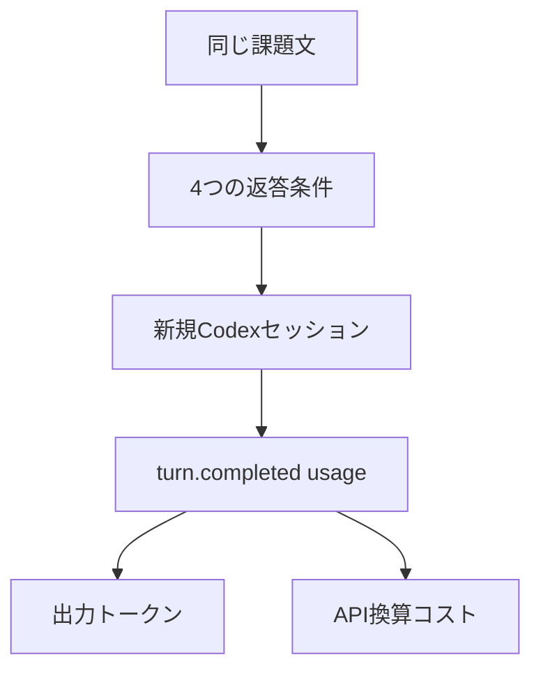

## 概要

- 8つの開発課題を日本語と英語で用意し、通常応答、単純な「簡潔に」、Caveman、Genshijinを各3回ずつCodexで実行した。
- Genshijinの出力は通常応答より日本語で27.5%短くなったが、英語では2.5%長くなった。
- 入力トークンと出力トークンをAPI換算すると、Genshijinは日本語で中央値+$0.01016、英語で+$0.013105だった。
- 私の推奨は、長い日本語の説明が中心ならGenshijinを試すこと。短い質問や英語の返答なら、まず「簡潔に」で十分だった。

ここでいうCodexは、コードの作成や修正を支援するOpenAIの開発用アシスタントだ。Genshijinは、その返答を短くするための追加指示であり、モデル自体を交換しない。APIは、モデルをトークン単位で呼び出す仕組みで、トークンは入力と出力を数える単位だ。

午前中、同じ質問をCodexへ何度も貼った。返答の中身は正しいのに、前置きと説明が少しずつ積み上がる。記録される出力トークンも増える。

そこで、GenshijinのREADMEにある「約75%削減」をそのまま信じる前に、同じ課題を192回比べた。結果は、日本語では確かに短くなった。ただし、入力コストまで含めると安くはならなかった。英語では、そもそも短くならなかった。

## Genshijinは何を変えるのか

Genshijinは、モデルを別のものに交換する仕組みではない。返答の書き方を指定するskillだ。日本語の敬語、クッション言葉、ぼかし、冗長な助詞を削り、必要な技術情報を残すように指示する。

英語圏の比較対象にCavemanがある。こちらもモデルへの追加指示（system prompt）として返答を短くする。Cavemanの「Honest Numbers」は、出力は平均65%減る一方、入力は減らず、skillの注入で1ターン約1,000から1,500 tokens増えると説明している。短い質問では、削った出力より増えた入力のほうが大きくなる。ここが、今回確かめたかった点だった。

なお、READMEの75%は出力の主張だ。Codexのサブスクリプション請求額が75%下がるという意味ではない。私は記事内で、出力トークン、入力トークン、API換算コストを別の数字として扱う。

## 192回の測り方

課題は、Reactのinline object prop、認証middlewareの期限境界、PostgreSQLのconnection pool、git rebaseとmerge、callbackからasync/awaitへの変換、monolithとmicroservices、小さなPRのsecurity review、PostgreSQLのlost update race conditionの8つにした。日本語版と英語版は同じ意味の別プロンプトだ。

条件は4つだけに固定した。

| 条件 | 追加した指示 |
|---|---|
| normal | 文体指定なし |
| terse | 「簡潔に回答してください」 |
| caveman-full | `$caveman full` |
| genshijin-normal | `$genshijin 通常` |

各課題、各条件を3回ずつ実行した。順番は課題ごとにseedを固定して無作為化した。毎回、新しい `codex exec --ephemeral --json` セッションを起動し、モデルは `gpt-5.6-sol`、reasoning effortは `low`、sandboxは `read-only` に固定した。プロンプトにはツールを使わず、最終回答だけ返すよう書いた。

各セッションが完了したときに返す使用量記録（`turn.completed.usage`）から `input_tokens`、`cached_input_tokens`、`cache_write_input_tokens`、`output_tokens`、`reasoning_output_tokens`を保存した。抜けた値を推測したセルはない。192件すべてがfinal textとusageを持ち、tool eventによる除外は0件だった。

価格はOpenAI公式ページのgpt-5.6-sol Standard short-contextを使った。inputは100万tokensあたり5ドル、cached inputは0.50ドル、cache writeは6.25ドル、outputは30ドルとして、保存したusageからAPI換算額を計算した。これはCodexの実請求額ではない。

## 出力は日本語だけ短くなった

中央値は次のとおりだった。1条件24件は、8課題×3試行を意味する。

| 言語 | normal | terse | caveman | genshijin |
|---|---:|---:|---:|---:|
| 日本語 | 708.5 | 281.5 | 636.5 | 483.5 |
| 英語 | 363.5 | 217.5 | 430.5 | 397.0 |

normalを基準に、同じ課題と試行を対応させた差分の中央値（paired median）では、terseは日本語で59.3%、英語で39.0%短くなった。Genshijinは日本語で27.5%短くなったが、英語では2.5%長くなった。Cavemanは日本語で13.5%短くなり、英語では26.1%長くなった。

この差は、単純な短さとskill固有の短さを分けて見る重要性を示す。日本語では「簡潔に」の一言がGenshijinより強く効いた。英語では、Genshijinを付けても通常応答の長さを下回らなかった。

なぜ差が出たかは、この測定だけでは断定できない。Genshijinの指示が日本語の敬語やクッション言葉を具体的に削るのに対し、英語では同じ削減対象が少ない可能性がある。ただし、言語ごとの文体差やプロンプト差を分離する実験ではないので、これは説明候補にとどめる。

## 二つの疑問への答え

「なぜ日本語だけ短くなったのか」への答えは、Genshijinが日本語の敬語やクッション言葉を削る指示を持つから、という仮説だ。今回の数字はその仮説と整合するが、原因を証明したわけではない。

「正確さや警告は維持されたのか」への答えは、192件すべてについては分からない、だ。私は代表2例でrebaseの警告と期限比較の演算子を目視しただけで、全回答の正確さを採点していない。

## 機械的に選んだ一例

代表例を手で選ぶと、結果がよく見える課題だけを載せてしまう。そこで、Genshijinの削減率が言語別の中央値に最も近い課題を自動で選んだ。

日本語はgit rebaseとmergeの比較、trial 1だった。normalは531 tokens、Genshijinは375 tokensで、29.4%減った。

normalは、共有ブランチではmerge、自分の作業ブランチではrebaseという判断と、`--force-with-lease`まで文章で説明した。Genshijinは同じ判断を短い箇条書きとコードで返し、警告も残した。短くなった理由は、結論を削ったからではなく、説明を圧縮したからだ。

英語は期限境界バグ、trial 3だった。normalは99 tokens、Genshijinは100 tokensで、1.0%増えた。どちらも `now >= expiresAt` を使う修正を示し、Genshijinのほうが1行多いだけだった。

この一例は、Genshijinが常に英語を膨らませるという証明ではない。8課題×3試行の中央値と、中央値に近いセルを同時に見るための材料だ。全出力はrun artifactに残した。

## 入力まで含めると安くない

出力だけを見ると、日本語のGenshijinは勝っている。API換算では結論が変わる。

| 言語 | 条件 | 中央値入力tokens | 中央値API換算 |
|---|---|---:|---:|
| 日本語 | normal | 24,230 | $0.05599 |
| 日本語 | genshijin | 26,854 | $0.083215 |
| 英語 | normal | 24,219.5 | $0.0296105 |
| 英語 | genshijin | 26,826 | $0.0424305 |

同じ課題と試行を対応させた差分は、日本語で中央値+$0.01016、英語で+$0.013105だった。中央値同士の単純な引き算ではなく、paired差分を使っているので表の丸め値とは一致しない。

Genshijinがnormalより追加したuncached inputは、日本語で中央値2,875.5 tokens、英語で2,609 tokensだった。output価格を1 tokenあたり0.00003ドルとして、入力分を取り戻すには日本語で約479 tokens、英語で約435 tokensのoutputを余分に削る必要がある。実際の削減は日本語196.5 tokens、英語は9 tokens増だった。

この計算で重要なのは、再利用されて割安になる入力（cached input）を都合よくゼロ扱いしなかったことだ。Codexはセッションごとにキャッシュ状態が変わり、同じ長さの入力でもuncachedとcachedの内訳が変わった。だから私は「skillが常に何tokensの固定費を足す」と断言しない。今回の条件で、providerが返したusageとAPI価格を組み合わせると、総額は増えた。これが言える範囲だ。

## 品質について言えること、言えないこと

192件すべてが空でなく、指定言語の文字信号を含み、ツール実行を宣言する不自然な文を含まないことは機械的に確認した。これは品質の合格判定ではない。

一方、代表例を見る限り、短縮条件でも、rebaseの共有ブランチに関する危険やtoken expiryの比較演算子は消えていない。これは「技術的正確さ100%」の証明ではなく、今回のサンプルで確認できた観察だ。誤った修正や手順の欠落を本当に測るには、条件名を隠した独立judgeを追加しなければならない。出力トークンの数字だけで品質を代用するのは危険だ。

したがって、「重要な警告や正確さが維持された」とは結論しない。今回は代表2例で警告と比較演算子が残ったことを目視しただけだ。

## 使うべき人、使わないほうがいい人

私は、長い日本語の設計説明、コードレビュー、調査メモを読む人にはGenshijinを試す価値があると思う。日本語では確かに文章が短くなり、単純なterse指示よりも、情報を残したまま圧縮する方向が見えるからだ。

ただし、出力の短さをそのまま節約額と呼ばない。今回のgpt-5.6-sol API換算では、日本語も英語もGenshijinの中央値コストが増えた。

短い質問が中心なら、まず「簡潔に」でいい。日本語のnormal 708.5 tokensに対してterseは281.5 tokensまで下がり、paired costはわずかに下がった。英語でもterseだけがnormalより短く、paired costは下がった。

英語の文章を短くしたい人は、GenshijinのREADMEや日本語版の印象を英語へ移植しないほうがいい。今回の英語8課題では、Genshijinは2.5%長くなった。Cavemanも26.1%長くなった。あなたの仕事で短くなるかは、言語、質問の長さ、キャッシュ状態を測ってから決めるべきだ。

subscriptionを使っている場合、API換算額がそのまま月額請求を下げるとは限らない。今回は読む時間を測っていないので、読みやすさの可能性とtoken priceの節約は分けて考える。

## 私の結論

Genshijinの約75%という数字は、Codexで誰にでも再現する割引率ではなかった。今回の192回では、日本語の出力を27.5%縮めたが、英語は2.5%増え、API換算コストは両言語で増えた。

使うなら、日本語で長い返答が続く仕事に限定して、同じ仕事のnormalとterseを数十回比べる。短い質問、英語中心、従量課金では、skillを足す前に「簡潔に」を試す。先に測る。これが今回の数字から出せる、いちばん地味で役に立つ答えだった。

## 出典

- [Genshijin repository](https://github.com/InterfaceX-co-jp/genshijin)
- [Genshijin benchmark harness](https://raw.githubusercontent.com/InterfaceX-co-jp/genshijin/main/benchmarks/run.py)
- [Caveman Honest Numbers](https://raw.githubusercontent.com/JuliusBrussee/caveman/main/docs/HONEST-NUMBERS.md)
- [OpenAI API pricing](https://developers.openai.com/api/docs/pricing)
- [Zenn article introducing genshijin](https://zenn.dev/sonicmoov/articles/8712598f532b18)

再現用の測定メモは https://aniccaai.com/ に置いています。

<!-- canonical-media:start -->

<!-- canonical-media:end -->

## さいごに
この記事では、その仕組みを解説しました。仕組みそのものに興味を持ってもらえたら嬉しいです。
