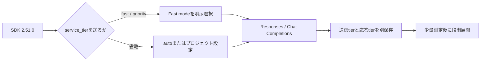

Responses APIまたはChat Completions APIを使う本番Pythonクライアントで、OpenAI Python SDK 2.51.0への更新を検討している人向けです。lockfileの版番号が変わっても、リクエストがFast modeを選んだ証拠にはなりません。判断に必要なのは、SDKの署名、実際のリクエスト本文、レスポンスの処理階層を分けた証跡です。

## SDK更新はFast modeを選ばない

OpenAI Python SDK v2.51.0のリリースノートには、Featureとして`api: fast tier`、Bug Fixとして`api: add fast tier to helper methods`が載っています。ここから言えるのは、SDKがFast tierの引数を扱えるようになったことです。依存関係の更新が、アプリの送信本文を変えたことまでは言えません。

Fast modeの公式ガイドは、リクエスト単位で`service_tier="fast"`を指定し、対応モデルでは`service_tier="priority"`も同じ動作になると説明しています。プロジェクト設定については「Requests that don't specify a `service_tier` then default to Fast mode」と明記しています。これはSDK更新とは別の設定変更です。

つまり、`service_tier="fast"`はそのリクエストの明示指定です。省略時はプロジェクトのService Tier設定に従い、SDKソース上の既定動作は`auto`です。2つを同じ入力としてログに残しません。

現行ガイドでは、Priority processingは「Priority processing was renamed Fast mode on July 30, 2026」と記載されています。既存コードに`priority`が残っていることと、実際のレイテンシーや請求が確認できたことは別です。ここでの結論は、リリースノートとガイドを組み合わせた推論です。SDKは選択肢を増やしますが、選択を自動で行う根拠にはなりません。

## 送信tierと応答tierを別保存する

次の4列を一つの記録に残します。

| 値 | 答える問い | 最小の証跡 |
| --- | --- | --- |
| `requested_service_tier` | クライアントは何を選んだか | 最終HTTPリクエスト本文 |
| `response_service_tier` | サービスはどの階層で処理したと返したか | レスポンス、リクエストID、モデル |
| `latency_ms` | SLOを満たしたか | 実APIでの計測 |
| `cost` | 請求にどう効いたか | 使用量ダッシュボードまたは請求データ |

公式ガイドは、トラフィックが急に増えるケースを「If your traffic ramps too fast」と表現し、一部のリクエストがStandardへ降格されると説明しています。その場合はStandard料金で請求され、レスポンスの`service_tier`は`default`になります。ガイドが示す目安は、毎分100万tokens以上を送り、15分以内にTPMを50%超増やすケースです。

この値は、送信本文だけでは分かりません。`fast`を送ったというログを残しても、返却値を保存しなければ、降格を後から判定できないからです。逆に、MockTransportの返却値はローカルfixtureです。実APIの降格結果として扱ってはいけません。

## MockTransportは送信境界とfixtureを検証する

v2.51.0の公式ソースで`service_tier`を受け取るメソッドは、次の4つです。

- `responses.create`
- `responses.parse`
- `chat.completions.create`
- `chat.completions.parse`

Chat Completionsのレスポンス型には`choices`のリストが必須です。Responses用のJSONをChat Completionsに返すと、モックが実行不能になるか、誤った境界を検証します。今回のテストでは、ResponsesにはResponses型、Chat Completionsには`choices[0]`を含むChat型を返しました。

次のコードは、`openai==2.51.0`と`httpx==0.28.1`を隔離した一時venvで実行しました。実測したのは、2つのcreate経路の送信本文、ローカルfixtureの返却tier、4つのcreate/parse署名です。速度、請求、モデルの利用可否、実APIの返却tierは測っていません。

```python
import inspect
import json

import httpx
from openai import OpenAI
from openai.resources.chat.completions import Completions
from openai.resources.responses import Responses

seen = []

def handler(request):
    body = json.loads(request.content)
    seen.append({"path": request.url.path, "body": body})
    if request.url.path.endswith("/chat/completions"):
        return httpx.Response(200, json={
            "id": "chatcmpl_feedback_recovery",
            "object": "chat.completion",
            "created": 0,
            "model": "gpt-5.6-sol",
            "choices": [{
                "index": 0,
                "message": {"role": "assistant", "content": "ok", "refusal": None},
                "finish_reason": "stop",
            }],
            "usage": None,
            "service_tier": "priority",
        })
    return httpx.Response(200, json={
        "id": "resp_feedback_recovery",
        "object": "response",
        "created_at": 0,
        "status": "completed",
        "error": None,
        "incomplete_details": None,
        "instructions": None,
        "max_output_tokens": None,
        "model": "gpt-5.6-sol",
        "output": [],
        "parallel_tool_calls": True,
        "temperature": 1.0,
        "tool_choice": "auto",
        "tools": [],
        "top_p": 1.0,
        "truncation": "disabled",
        "usage": None,
        "metadata": {},
        "text": {"format": {"type": "text"}, "verbosity": "medium"},
        "reasoning": {"effort": None, "summary": None},
        "store": True,
        "service_tier": "priority",
    })

client = OpenAI(
    api_key="sk-test",
    http_client=httpx.Client(transport=httpx.MockTransport(handler)),
)
responses_result = client.responses.create(
    model="gpt-5.6-sol", input="test", service_tier="fast"
)
chat_result = client.chat.completions.create(
    model="gpt-5.6-sol",
    messages=[{"role": "user", "content": "test"}],
    service_tier="priority",
)

assert seen[0]["body"]["service_tier"] == "fast"
assert seen[1]["body"]["service_tier"] == "priority"
assert responses_result.service_tier == "priority"
assert chat_result.service_tier == "priority"
assert "service_tier" in inspect.signature(Responses.create).parameters
assert "service_tier" in inspect.signature(Responses.parse).parameters
assert "service_tier" in inspect.signature(Completions.create).parameters
assert "service_tier" in inspect.signature(Completions.parse).parameters
print(json.dumps({
    "seen": seen,
    "response_service_tier": {
        "responses": responses_result.service_tier,
        "chat_completions": chat_result.service_tier,
    },
}, sort_keys=True))
```

この実行で得た送信本文は、Responsesでは`service_tier: "fast"`、Chat Completionsでは`service_tier: "priority"`でした。両方のローカルfixtureからは`response_service_tier: "priority"`を読み取り、Chat用のfixtureは`choices[0]`を含みます。これが証明するのは、SDK 2.51.0の2つのcreate経路が指定値を送信本文へ渡し、4つのメソッド署名がその引数を持つことだけです。実APIの返却値や速度は、別の測定が必要です。

`parse`を使うアプリでは、構造化出力のfixtureも追加します。parseの署名が存在することと、アプリ固有のレスポンスが正しく解析できることは同じではありません。

## Fast modeの境界：降格・対象外・料金

Fast modeの公式ガイドは、`gpt-5.6-sol`で最大2.5倍速いと説明しています。これはOpenAIの性能説明であり、上のMockTransportの計測値ではありません。自分のSLOに使う数字は、実APIで測ります。

したがって、この例の速度差は「最大2.5倍」という公式説明で、実測結果ではありません。料金は短いコンテキストの`gpt-5.6-sol`なら、Standardの入力$5.00・出力$30.00に対してFast modeは入力$10.00・出力$60.00です。入力と出力はいずれも2倍になります。

対象外も先に確認します。Fast modeの対象外はLong context、fine-tuned models、embeddingsです。FAQは画像入力について「the same multimodal capabilities available on Standard」と説明しています。一方、大規模なETLやバッチは対象外という意味ではなく、急な増加を招くためFast modeに不向きなワークロードです。対象モデル、入力条件、ワークロードを確認せず、全トラフィックへフラグを広げる理由にはなりません。

価格表は100万tokens単位です。`gpt-5.6-sol`の短いコンテキストでは、次の数字が掲載されています。

| 処理 | 入力 | Cached input | Cache writes | 出力 |
| --- | ---: | ---: | ---: | ---: |
| Standard | $5.00 | $0.50 | $6.25 | $30.00 |
| Fast mode | $10.00 | $1.00 | $12.50 | $60.00 |

この例では入力と出力がそれぞれStandardの2倍です。長いコンテキスト、データレジデンシー、別モデルでは表の条件が変わるため、対象モデルの行をその都度確認します。Fast modeが速いという説明だけで、料金や対象範囲を省略してはいけません。

## ロールアウトの順序：明示指定から実API検証へ

本番で変更する順序は、影響範囲の小さい順にします。

1. lockfileとSDK署名を読み、2.51.0が実際に入っていることを確認する。
2. アプリが使うResponsesまたはChat Completionsについて、正しいレスポンス形状のMockTransportでcreateとparseの境界を検証する。
3. 低レイテンシーが必要な経路だけ、`service_tier="fast"`を明示して機能フラグを付ける。
4. 少量の実APIトラフィックで、SDK版、リクエスト本文、レスポンスtier、モデル、リクエストID、レイテンシー、料金を一緒に保存する。
5. 降格、対象外ワークロード、SLO、価格を確認してから、数時間かけて段階的に割合を増やす。

プロジェクト設定でFastを既定値にする場合は、設定変更の時刻と対象プロジェクトも記録します。`service_tier`を省略した経路まで挙動が変わるためです。公式ガイドも「Avoid running large extract, transform, and load (ETL) or batch jobs in Fast mode.」と案内しています。大量のETLやバッチを一度に流す運用は避けます。



## 最初の実API証跡に5つの値を保存する

Fast modeを初めて有効にする経路を一つ選び、検証テンプレートにSDK版、リクエスト本文のtier、レスポンスtier、レイテンシー、料金を保存します。Chat Completionsなら、ChatCompletion型が要求する`choices`のfixtureを先に通します。これがこの読者の次の作業です。

末尾の検証テンプレートは、最初のlive requestの返却tier、レイテンシー、料金を記録して比較するための利用先です。最初の5項目を記録するには、検証テンプレートを開いて実測結果を保存してください。公式ガイドは実APIの件数を固定していないため、最初は全体の一部だけの少量トラフィックに絞ります。具体的な割合はSLOと失敗時の影響で決め、固定値として断定しません。同じモデルと入力条件でStandardとFastを測り、`latency_ms`の中央値とp95、返却tier、料金を比較してから機能フラグの割合を増やします。ローカルのPASSを本番の速度や請求の証拠にはしません。

---

## Sources

- [OpenAI Python SDK 2.51.0 release](https://github.com/openai/openai-python/releases/tag/v2.51.0)
- [OpenAI Fast mode guide](https://developers.openai.com/api/docs/guides/fast-mode)
- [OpenAI API pricing](https://developers.openai.com/api/docs/pricing?latest-pricing=fast)
- [Responses resource in openai-python v2.51.0](https://raw.githubusercontent.com/openai/openai-python/v2.51.0/src/openai/resources/responses/responses.py)
- [Chat Completions resource in openai-python v2.51.0](https://raw.githubusercontent.com/openai/openai-python/v2.51.0/src/openai/resources/chat/completions/completions.py)
- [ChatCompletion response model in openai-python v2.51.0](https://raw.githubusercontent.com/openai/openai-python/v2.51.0/src/openai/types/chat/chat_completion.py)
- [OpenAI Fast mode FAQ](https://help.openai.com/en/articles/11647665-priority-processing-faq)
- [検証テンプレート](https://aniccaai.com/?product_id=anicca&run_id=20260802-000152&artifact_id=article-ja&variant_id=title-sdk-fast-no-auto&click_id=20260802-000152-article-ja)

<!-- canonical-media:start -->

<!-- canonical-media:end -->

## さいごに
SDKの更新とFast modeの選択を切り分けるための境界を整理しました。
<!-- zenn-deferred-retry:b77c52882770308c7082d512706517a962f0d7d8 -->
