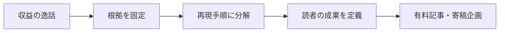

午前中に、AIで作業を早く終えた話を投稿した。反応は悪くない。でも、その数字を一段落で書き終えた時点で、売れる記事にも寄稿企画にもなっていない。読者が買うのは、こちらの景気のいい話ではなく、自分の失敗を一つ減らせる手順です。

先に結論を書く。AIを使った収益や自動化の経験を記事にするなら、成果を盛るより、再現の条件を固定した方が強い。有料にするのは「AIで稼げた」という結論ではない。誰が、どの材料を使い、どこで止まり、何を確認したら次へ進めるかです。

## 企画にする前の判定

- 読者が今日ためせる行動が一つあるか
- その行動の入力と、成功・停止の判定が書けるか
- 成果の数字に出典か観測範囲を添えられるか
- 有料部分に、読者の試行錯誤を短くする実物があるか

四つのうち一つでも空欄なら、まだ公開用の企画ではありません。悪い状態ではない。ただ、経験談のままです。

## 収益の逸話を分解する

「AIで記事を作り、売れた」は入力が抜けています。使った素材、読者、配布先、修正回数、やらなかったことを一枚に置きます。数字が自己申告なら、自己申告と書く。売上を確認できないなら、売上の主張を商品価値にしない。この地味な線引きが、読者との約束になります。

たとえば、MuchoAi は「Claude Codeで稼ぐ」対象をアプリ開発だけにせず、有料ニュースレター、有料記事、プロンプトやテンプレートの配布まで並べています。これは公開投稿に書かれた本人の説明です。収益数値は本人の申告として扱い、ここから借りるのは金額ではなく、無料の導線と、手順・テンプレートを有料側へ置く構成です。

マロンの長文投稿も、AI利用を売上の話だけで閉じず、読者が使える資料と順番まで置く必要を示しています。こちらも個人の公開内容として扱い、金額の裏付けには使いません。

同じく、AI活用の話をそのまま販売せず、読者が自分の仕事へ置き換えられる手順に直す必要があります。技術系の寄稿先は、一般論よりも、特定のツールや問題を実演する tutorial と how-to を求めています。

## 読者の作業に直す

ここで記事の主語を「私の成功」から「読者の次の一手」へ変えます。読者が有料記事を買う理由は、称賛ではなく、迷う時間を買い戻すためです。

企画書には次の順で書きます。

1. 読者が今つまずく一場面を書く。たとえば、AIに長い指示を渡したのに、引用のない原稿しか残らない。
2. 入力を決める。一次資料のURL、確認する事実、公開してよい範囲を列にする。
3. 出力を決める。下書きだけで終えず、読者が使えるチェックリスト、テンプレート、判断表を一つ付ける。
4. 停止条件を決める。根拠がない数字、権限のない個人情報、再現不能な主張は残さない。

Airbyte の寄稿案内は、教育目的の技術コンテンツを対象にし、翻訳・既存オンライン資料・AIツールからそのまま生成した内容を認めていません。媒体名を借りて権威づけする話ではありません。編集者が読み直せる材料を最初から揃える、という普通の仕事です。

## 価格の前に置く実物

500円の記事でも、無料部分は結論だけ、有料部分は手順だけ、という分け方では弱い。無料部分で読者に一度判断してもらい、有料部分でその判断を実行に移す材料を渡します。たとえば、次の三点です。

- 成果主張ごとに、出典・観測日・確認できない範囲を書く表
- 企画を読者ジョブ、入力、出力、停止条件へ分けるテンプレート
- 公開前に「これは経験談か、再現手順か」を判定するチェックリスト

この三つがあれば、読者は成功談を信じるかどうかで止まりません。自分の素材を使って、次の企画を作れます。反対に、派手な数字だけなら、読み終えたあとに残るのは羨ましさで、行動ではありません。

## 小さな検証から始める

最初から長い講座にしなくていい。自分の直近の作業を一つ選び、入力、判断、出力、失敗条件を200字ずつで書く。その紙だけを見せても読者が動けるなら、記事の芯があります。動けないなら、AIの能力を説明しているだけかもしれません。

公開前に使える、証拠つきの企画テンプレートと編集チェックを出典欄に置いています。
---

## 出典

- [AIクリエイターの実践例](https://x.com/MuchoAi/status/2079105435056107721)
- [マロンの公開記事](https://x.com/rimuruafi/status/2069458256238612785)
- [Civo Write for Us](https://www.civo.com/write-for-us)
- [Airbyte Write for the Community](https://airbyte.com/write-for-the-community)
- [企画を読者の次の行動へ変える](https://aniccaai.com/?product_id=anicca&run_id=20260806-084924&artifact_id=article-ja&variant_id=evidence-four-checks&click_id=20260806-084924-article-ja)

<!-- canonical-media:start -->

<!-- canonical-media:end -->

## さいごに
この記事では、その仕組みを解説しました。仕組みそのものに興味を持ってもらえたら嬉しいです。
<!-- zenn-deferred-retry:458d6317455fb0a77079cae7887e9ec658f242e4 -->
