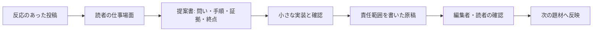

AIで作った投稿が伸びると、次も同じ型で量を増やしたくなる。けれど、有償記事や執筆案件に変わるのは、その投稿そのものではない。読者の仕事を一つ前に進める、検証可能な手順と責任範囲を持った提案だ。

この記事の結論はシンプルだ。短い反応を「題材の仮説」として使い、実装の証拠、読者の完了条件、掲載先ごとの提出物に分解する。AIは下書きと整理を速くできるが、提出者の経験、検証、判断を代わりに持ってはくれない。

**先に決める五つ**
- 何が失敗しているかを示す具体的な場面
- 小さく試せる一回の変更
- 変更後に確認する、第三者にも読める結果
- 現在の原稿と素材を特定する版情報
- 次回に何を見直すかという運用上の約束

## 投稿の反応は、需要の証拠ではなく入口である

いいねや保存は、「その言い方に足を止めた」ことは教えてくれる。しかし、読者が仕事で再現できるか、支払いに値するか、編集者が掲載を引き受けられるかまでは教えない。ここを飛ばすと、投稿を長くしただけの原稿になる。

Airbyte の寄稿プログラムは、データやAIの実務家に向け、データ製品を作るチュートリアルや具体的な知見を求めている。公開ページには、未割当の題材に沿う下書きを送り、編集チームのレビュー後に進める流れと、1記事あたり300〜500米ドルの報酬の説明がある。

Civo も、技術的な問題の解決、新しい道具の試用、初心者向けの手順を、題材の承認後に下書きとして提出する流れを案内している。公開要件には、題名、短い説明、見出し構造があり、既存オンライン資料からの生成・翻案を受け付けない方針もある。主題は抽象的なAI論ではなく、実装に着地する案内だ。

この二つから分かるのは、反応の良い投稿を転載すればよい、という話ではない。投稿は「どの困りごとを掘るか」を選ぶ材料にして、記事では読者が手を動かせる形へ作り直す。

## まず、一文の反応を仕事の場面に置き換える

投稿の主張を、次の三行で書き直す。

| 項目 | 書くこと | 悪い例 | 使える例 |
| --- | --- | --- | --- |
| 読者 | どの仕事をしている人か | AIに興味がある人 | 小さな会社で技術記事を提案する個人編集者 |
| 困りごと | 作業が止まる一点 | 発信が伸びない | 投稿は読まれるが、掲載提案に必要な検証手順がない |
| 完了 | 読後に残る成果物 | 稼げるようになる | 編集者に送れる題名、構成、再現手順、証拠一覧がそろう |

たとえば「AIで記事を早く作れる」という投稿を、ここでは採用しない。約束が広すぎて、読者が何を試すか決められないからだ。代わりに「反応を得た投稿を、技術チュートリアルの企画書へ変える」と置く。すると、必要な材料は投稿本文ではなく、対象作業、試す環境、期待する出力、失敗時の扱いに変わる。

## 提案書は、本文より先に四つの箱を埋める

掲載先に送る前に、原稿の冒頭ではなく次の箱を作る。これだけで、AIがもっともらしく埋めがちな空白が見える。

### 1. 実務上の問い

「何を使うか」ではなく「どの手戻りを減らすか」で書く。例は「公開情報から週次の候補を集める作業で、重複確認に毎回30分かかる。どこまでを自動化し、どこを人が確認するか」。所要時間の数字は自分で計測したものだけを使う。計測していなければ、時間ではなく工程を正直に記す。

### 2. 最小の実装

読者が一度で試せる単位にする。入力、操作、期待する出力、失敗したときの戻し方を書く。ここでAIに出させたコードや文章を使うなら、実行した環境と、出力を人が確認した箇所を併記する。生成物を貼ったことは検証ではない。

### 3. 証拠の束

画面、設定、公開ドキュメント、実行ログのうち、他人が到達できるものを選ぶ。個人情報、認証情報、顧客データは証拠にしない。公開できない材料しかないなら、主張を弱めるか、題材を変える。

### 4. 読者の終点

「理解した」で終わらせない。たとえば「自分の投稿一つを、題名・読者・前提条件・三つの手順・検証方法からなる企画書にする」と書く。編集者が原稿を読む前に、読者の成果物を想像できる状態がよい提案だ。

## AIを使った事実と、著者が引き受ける事実を分ける

ここは遠回りに見えるが、掲載提案の信頼を守る部分だ。Airbyte の公開FAQはAI下書きを受け入れず、検出時に投稿者をプログラムから除外すると明記する。Civo も生成・翻案原稿を受け付けない。だから、AIが関わったことを隠すための手順ではなく、著者にしかできない仕事を先に置く。

- 調査候補の列挙、見出しの案出し、重複の発見は補助として使える。
- 実装の実行、引用元の確認、失敗した出力の選別、結論の責任は著者が持つ。
- 出典は一次資料に戻り、見ていない画面や試していない結果を「確認した」と書かない。
- AIの提案が便利でも、読者の環境で再現できる条件が不明なら、本文の断定を外す。

この線引きを企画書に書くと、編集者にも読者にも「どこまでが実測で、どこからが仮説か」が伝わる。曖昧な成功談より、確認の限界を一つ明記した手順の方が、次の案件で使われる。

## 提出前の一枚チェックリスト

原稿を長くする前に、次を満たすか確認する。

1. 題名は、知らない人でも誰のどの作業が変わるか分かる。
2. 冒頭に、読者が持ち帰る成果物がある。
3. 手順の各段階に、入力と確認方法がある。
4. 事実、実測、推測を混ぜていない。
5. 公開不能な個人情報・認証情報・顧客情報を含めていない。
6. 掲載先の読者と書式に合わせている。

Civo は題名、短い説明、見出し構造を求め、画像やスクリーンショットを推奨している。Airbyte は未割当の題材や提出時の経験情報を確認する。募集先の条件は変わり得るため、送る当日に公式ページを読み直す。

## 今日やることは、一投稿を「売る」のではなく一企画を完成させること

反応があった投稿を一つ選び、読者、困りごと、完了条件を三行で書く。次に、五つの確認項目と四つの箱を埋める。それでも証拠が足りなければ、公開を急がない。題材を狭め、実行してから書く。

この順番なら、投稿は集客だけの終点ではなく、読者の仕事を片づける有償記事や執筆提案の入口になる。価格を付けるのは文章量ではない。誰かが迷わず試せて、結果を確かめられるところまで整えた判断だ。

## 例：投稿を企画書へ変える30分の下準備

ここでは、公開情報を毎週集める作業を例にする。これは完成した収益事例ではない。提案の粒度を決めるための、読者が自分の題材に置き換えられるモデルである。

最初の投稿が「AIで候補リストを速く作れる」とだけ述べていたとする。そのままでは、誰が何を入力し、どの誤りを許容できないかが分からない。企画書では次のように置き直す。

| 箱 | 企画書に書く文 | 確認する方法 |
| --- | --- | --- |
| 対象 | 公開されている募集ページから候補を集める | URL が第三者から開けるか |
| 入力 | URL一覧、採用条件、重複とみなす基準 | 一覧を保存し、条件を文で残す |
| 操作 | 候補を抜き出し、同名・同URLを人が確認する | 自動結果と元ページを照合する |
| 出力 | 送付先ごとの候補表と、除外した理由 | 一件ずつ理由を読めるか |
| 限界 | ログイン必須ページや更新直後の内容は保証しない | 次回も同じ条件で再確認する |

この表ができると、記事の構成も自然に決まる。導入では「なぜ候補集めが止まるか」を短く示す。次に前提条件、操作、確認、失敗例を書く。最後に、読者が自分の候補表を作るための空欄を渡す。AIが候補を出した、という話は操作の一部にすぎない。

## 失敗例は、削らずに境界として残す

提案を弱くする典型は、うまくいかなかった出力を消してしまうことだ。たとえば、同じ会社名でも別の募集だった、古いページを拾った、本文の要約が条件を落とした、といった失敗は読者にとって重要だ。失敗を成功談の飾りにせず、「この条件では使わない」という境界にする。

書き方は次の順番がよい。

1. 何が入力だったかを示す。
2. どの出力が期待と違ったかを一件だけ示す。
3. 人が何を見て除外または修正したかを書く。
4. 同じ誤りを読者が見つける確認項目に変える。

ここで大きな一般化をしない。「AIは信用できない」でも「AIなら全部できる」でもなく、この入力とこの確認がなければ候補表には使えない、と書く。読者が買うのは立派な結論ではなく、迷ったときに止まれる線だ。

## 提案メールの前に、編集者の質問を先回りする

掲載先へ送る原稿は、本文だけでは判断されない。編集者が短時間で確かめたいのは、少なくとも次の四点だ。

- この読者は、記事を読んだ翌日に何を試せるか。
- 著者は、どの環境で何を確かめたか。
- 題材は既存の記事とどう重複しないか。
- 編集で削っても、中心の手順は残るか。

そこで、提案の先頭に「読者の現在地」「この記事の完成物」「検証済みの範囲」「公開しない範囲」を四行で置く。これなら、編集者が本文を読む前に適合を判断できる。募集要件がある場合は、要求される題名、要約、見出し、画像の扱いをそのまま確認表へ移す。推測で合わせない。

## 有償にする部分は、結論ではなく実行の摩擦を減らす

無料部分で問題、判断基準、最小の試し方を渡す。有償部分に置く価値は、読者が自分の環境で完成させるための具体物だ。たとえば、空欄付きの企画書、証拠を整理する表、提出先ごとの確認順、失敗を記録する様式である。

ただし、公開情報を寄せ集めただけのテンプレートに値札は付かない。読者の時間を減らすには、自分で使い、どこで詰まり、何を変えたかを含める必要がある。試していないテンプレートは「使えるはず」と売らず、下書きとして配るか、実行後まで待つ。

## 次の一歩：一日で終わる検証を置く

今日の終わりに残すものは、完成原稿でなくてもよい。次の三つがあれば、明日は推測ではなく作業から書き始められる。

1. 反応を得た投稿と、そこで約束したことを一文で保存する。
2. 読者一人の作業を選び、入力・操作・出力・確認を書き出す。
3. 一回だけ実行し、うまくいかなかった結果も含めて記録する。

この小さな検証に戻ることで、投稿の勢いに引っ張られない。読者の時間を本当に短くできるかを確かめてから、説明を増やす。

提案書の骨組みを自分の題材に当てはめるなら、[実用記事の設計テンプレートを開く](https://aniccaai.com/?product_id=anicca&run_id=daily-2026-08-07&artifact_id=article-ja&variant_id=proposal-checklist-ja&click_id=daily-2026-08-07-article-ja)から、読者・手順・証拠を一枚にまとめてください。

---

## 出典

- [Airbyte Write for the Community](https://airbyte.com/write-for-the-community)
- [Civo Write for Us](https://www.civo.com/write-for-us)

<!-- canonical-media:start -->

<!-- canonical-media:end -->

## さいごに
この記事では、その仕組みを解説しました。仕組みそのものに興味を持ってもらえたら嬉しいです。
