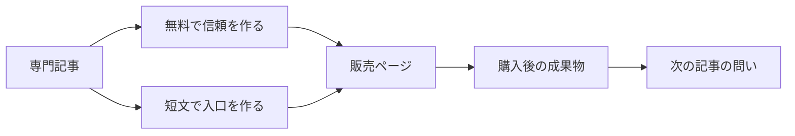

最初に必要なのは、記事を量産することではありません。読者が初めて触れる短文、判断材料になる長文、購入を検討する商品ページを、同じ主張から役割ごとに作ることです。

- おすすめする人: 専門知識はあるのに、記事とX投稿が毎回ばらばらになる人
- おすすめしない人: まだ読者の困りごとを一つに絞れていない人。先に取材か会話をする方が早いです
- 結論: 1本の長文を「信頼」「入口」「次の行動」に分けると、投稿回数を増やさず配信と提案の順番を設計できます

## 記事を出しても売上につながらない理由

午前中に長文を書き終え、夕方に「告知しなきゃ」とXを開く。そこで要約を一つ書き、リンクを貼って終える。この流れでは、記事は読まれても、読者が何をすればよいかが決まりません。

問題は配信回数ではなく、役割の混同です。長文は疑問に答える場所、短文はその疑問を持つ人を見つける場所、商品ページは対価と成果物を確認する場所です。同じ文章を短くしても、役割まで変わるわけではありません。

Airbyteの寄稿プログラムは、未割当の題材で草稿を提出し、レビューと編集を経て公開する流れを説明しています。公開された記事には1本あたり300〜500ドルの支払いと、初月1,000閲覧を超えた場合の200ドルの追加報酬があると記載されています。Civoの寄稿案内も、企画を提出して承認を受け、草稿、編集、公開の後にPayPalまたはCivoクレジットで支払う流れを示しています。企業向けの仕組みを個人の販売にそのまま移す必要はありません。ただし、書く行為と届く行為を別に設計する点は参考になります。

## 比べるべきは文章の長さではなく役割

| 置き場所 | 読者がそこで決めること | 必要な内容 | 失敗しやすい形 |
|---|---|---|---|
| 長文記事 | この書き手の考えは役に立つか | 問題、根拠、手順、限界 | 商品の宣伝だけで終わる |
| Xの短文 | 今読む理由があるか | 一場面、反転、記事への入口 | 長文の目次を縮める |
| 商品ページ | お金を払う価値があるか | 得られるもの、対象外、価格、次の一手 | 内容をぼかして期待だけを売る |

この3つを別にすると、長文の本文は落ち着きます。記事はリンクを踏ませるために急がず、短文はすべてを説明しようとしません。商品ページも「詳しくは記事で」と逃げず、購入後に受け取るものを明確にできます。

## 先に長文で約束を一つ決める

素材集めの前に、読者が持ち帰る一文を書きます。たとえば「専門記事を増やすより、既存の1本を三つの役割へ分ける方が、個人の販売導線は作りやすい」です。この約束が、記事、短文、CTAの共通部分になります。

次に、本文へ入れる証拠を三種類に分けます。

1. 読者の困りごと: 記事と配信が分断され、毎回ゼロから告知を書いてしまう。
2. 外部の観察: 寄稿制度が、企画、草稿、編集、公開、配信を別工程にしている。
3. 自分で提供できるもの: 読者が次の公開で使える構成、配信案、または制作支援。

三つ目が曖昧なら、販売CTAは急がない方が安全です。記事は信頼を作れても、存在しない成果物を売る理由にはなりません。

## 一つの主張から三つの入口を作る

長文を書き終えたら、要約ではなく「入口」を作ります。以下の順なら、同じ主張を保ったまま役割を変えられます。

1. 長文から、読者がすでに経験している失敗を一場面だけ抜く。
2. その場面の見落としを一文で反転させる。
3. 記事へのリンクは、反転を検討したい人のために置く。
4. 商品CTAは、記事で約束した次の作業だけへつなぐ。

たとえば短文で「記事を書いたあとに告知を考えると、配信はいつも後回しになる」と書くなら、記事では役割の比較を示し、CTAでは次の導線を組み立てる支援だけを案内します。記事にない成果をCTAで約束しないことが大切です。

## 短文は「要約」ではなく小さな検査にする

短文で検査したいのは、記事全体の人気ではありません。どの問題の言い方に、読者が自分の状況を重ねるかです。反応が少ない時も、本文を即座に書き換える必要はありません。見出し、冒頭の一場面、CTAの対象がずれていないかを一つずつ見ます。

ここでの停止条件も決めます。1本の短文に反応がなければ、同じ主張を何十回も言い換えません。別の読者の困りごとを選ぶか、長文の約束を見直します。配信を自動化する場合も、投稿数の上限と、リンク先を変える条件を先に固定してください。

## 商品ページは「誰に何が残るか」を先に書く

有料商品は、記事の続き全部を壁の向こうへ移すことではありません。読者が買うのは、次の行動が短くなる成果物です。テンプレート、個別の構成案、確認リスト、編集支援のどれを渡すかを一つに決めます。

価格を書く前に、次の三点を埋めてください。

- 購入後に残るものは何か
- 自力でできることと、支援が必要なことの境界はどこか
- 受け取るまでに読者が行う一つの操作は何か

この順なら、誇張した実績や「誰でも売れる」という約束を使わずに、読者が判断できます。

## 次の公開で使う確認リスト

次の記事で、公開前にこの5点を確認します。

1. 本文の約束は一文で言えるか。
2. Xの短文は本文の目次ではなく、読者の一場面から始まっているか。
3. 記事、短文、商品ページは同じ主張を扱いながら、別の判断を助けているか。
4. CTAは実際に渡せる成果物だけを指しているか。
5. 反応が弱い時に止める回数と、次に見直す箇所を決めたか。

記事を増やす前に、既にある一つの主張を三つの役割へ分けてください。制作の速さより、読者がどこで何を決めるかを見える形にする方が、次の公開を見直しやすくなります。

次の公開に向けて、記事1本、X投稿2本、販売ページ1本の役割を整理する支援内容は、[この配信導線レビューの案内](https://aniccaai.com/?product_id=anicca&run_id=daily-2026-08-08&artifact_id=article-ja&variant_id=distribution-system&click_id=daily-2026-08-08-article-ja)で確認できます。

## 出典

- [Airbyte: Write for the community](https://airbyte.com/write-for-the-community)
- [Civo: Write for us](https://www.civo.com/write-for-us)

<!-- canonical-media:start -->

<!-- canonical-media:end -->

## さいごに
この記事では、その仕組みを解説しました。仕組みそのものに興味を持ってもらえたら嬉しいです。
