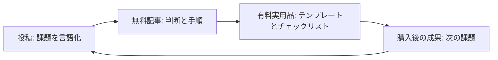

AIで投稿や記事を速く作れるようになっても、購入は自動では増えない。理由は単純です。投稿、無料記事、有料商品に同じ仕事をさせようとしているからです。

最初に作るべきなのは「毎日投稿する仕組み」ではなく、読者が次へ進む理由を一つずつ渡す導線です。投稿は課題を言葉にする。無料記事は判断と手順を渡す。有料商品は、読者の作業を終わらせる実用品を渡す。この三つを混ぜないことが、AIを使う個人販売者にとっていちばん再現しやすい組み方です。

この記事は、AI活用コンテンツやテンプレートを販売したい個人事業主向けです。すでに投稿をしているのに、何を無料にし、何を売るかが曖昧な人はこの順で組み替えてください。まだ題材も読者も決まっていない段階なら、先に一つの読者層と一つの困りごとを決めるほうが先です。

## 先に5分で点検すること

- 直近の投稿は、誰のどんな困りごとを言い当てているか。
- 無料記事には、その人が自分で選べる判断基準があるか。
- 有料商品には、読むだけでなく使えるファイル、雛形、手順表のどれかがあるか。
- 三つのリンクは、同じリンク先ではなく次の役割へつながっているか。
- 各リンクを計測でき、何が購入に近づけたかを次回に読めるか。

一つでも空欄なら、投稿数を増やす前にそこを埋めます。

## 導線は「長いセールス文」ではない

導線という言葉から、何段もの自動メールや派手な広告を想像する必要はありません。ここでいう導線は、読者が今いる状態ごとに次の一手を変える組み方です。

投稿を読んだ人は、まだ問題を自分の言葉で説明できないことが多い。無料記事を読んだ人は、問題の優先順位や手順を理解し始める。有料商品を買う人は、理解ではなく「今日の作業を短くしたい」と考えています。そこで全員に同じ説明を繰り返すと、読むほど前へ進めなくなります。

## 役割1: 投稿では「自分の問題だ」と分かる一場面だけを置く

投稿で完結した講義をしようとすると、無料記事へ進む理由が消えます。投稿の仕事は、読者が見過ごしている摩擦を一つだけ具体化することです。

たとえば「AIで文章を書いているのに売れない」という抽象的な悩みを、「投稿の末尾が毎回『詳しくはリンクへ』で終わり、リンク先で何が得られるかが分からない」に言い換えます。読者は、自分の投稿を見直せるようになります。ここで解決策を全部出す必要はありません。無料記事で判断できる、と約束するだけで十分です。

Xの長文コンテンツでは、無料の知識と有料の手順・テンプレートを分け、短い投稿から記事へ案内する使い方が実際に見られます。ただし、公開者の売上や成果は自己申告であることがあるため、ここでは数字ではなく役割の分離だけを採用します。

## 役割2: 無料記事では「何を作らないか」まで決められるようにする

無料記事の価値は情報量ではありません。読者が、次の一週間にやらないことを決められるかです。

この記事の読者なら、まず一つの販売テーマを選び、次の表を埋めます。

| 場所 | 読者の状態 | 渡すもの | 渡さないもの |
| --- | --- | --- | --- |
| 投稿 | 困りごとを曖昧に感じている | 一場面、問い、失敗の名前 | 全手順、価格表 |
| 無料記事 | 方法を比較したい | 判断基準、最小手順、失敗例 | 配布可能な完成品全部 |
| 有料商品 | すぐ実行したい | テンプレート、記入例、チェックリスト | 新しい宣伝文 |

この表が有効なのは、無料部分をわざと薄くするためではありません。無料記事だけでも読者が正しい選択をできるようにし、その後に時間を節約する完成品を別の価値として出せるからです。

有償寄稿プログラムの募集でも、単なる概説より、具体的な問題を解く tutorial や how-to が求められています。Airbyte は採用されたコミュニティ記事に300〜500ドルの報酬を案内し、Civo は提案を承認してから初稿、編集、公開へ進み、公開後に支払う流れを示しています。販売導線でも同じで、読者は「もっと文章があること」より、今の段階で使える成果物にお金を払います。

## 役割3: 有料商品は「読むもの」ではなく「埋めて終わるもの」にする

有料化の境目を文字数で決めると、購入後に読者の作業が残ります。代わりに、購入後30分で使えるものを一つ選びます。

- 投稿の下書きを三つ作る入力シート
- 無料記事から有料版へ分ける判断チェックリスト
- CTA（次の行動を促す文）を読者の状態別に書き分ける雛形
- 販売ページに必要な証拠、対象外、返金条件を確認する表

ここで重要なのは、成果を約束しないことです。テンプレートは購入や売上を保証しません。代わりに、読者が「誰向けか」「何を無料にするか」「何を完成品として売るか」を決める時間を短縮します。価値の説明も、この時間短縮に戻します。

販売導線を自分のテーマで組み立てるためのワークシートと計測用リンクの例は、末尾の案内に置きます。

## AIは「増幅器」として使い、判断を渡さない

AIは、読者の発言から困りごとの候補を整理したり、同じ主張を投稿向けと記事向けに書き分けたりするのに向いています。一方で、何を売るか、誰を対象外にするか、根拠が十分かは人が決めます。

実務では次の順が安全です。最初に人が読者と商品境界を一文で決める。次にAIで投稿案、見出し案、比較表のたたきを作る。最後に人が一次資料、価格、約束、リンク先を確認する。AIに「売れる商品を考えて」と丸投げすると、広すぎる対象や根拠のない約束が混ざりやすくなります。

## 明日からの最小実装

明日は、商品を増やさずに一つのテーマだけで試します。

1. 既存の投稿から、読者の困りごとが一文で分かるものを一つ選ぶ。
2. その投稿で省いた判断基準を、無料記事の見出し三つにする。
3. 判断した後に残る手作業を一つ選び、チェックリストか雛形にする。
4. 投稿、記事、商品に別々の計測リンクを置く。
5. 一週間後、クリック数だけでなく、どこで読者が止まったかを読む。

投稿を増やす前に役割を分けると、AIは量産機ではなく、同じ読者のために形を変える編集道具になります。売るために必要なのは、すべてを有料にすることではありません。無料で判断を渡し、有料で作業を終わらせることです。

## 出典

- [Airbyte: Write for the community](https://airbyte.com/write-for-the-community)
- [Civo: Write for Us](https://www.civo.com/write-for-us)
- [X long-form example: content-to-product funnel](https://x.com/MuchoAi/status/2079105435056107721)
- [X long-form example: distribution and paid-content framing](https://x.com/rimuruafi/status/2069458256238612785)
- [導線の組み方を始める](https://aniccaai.com/?product_id=anicca&run_id=daily-2026-08-09&artifact_id=article-ja&variant_id=funnel-roles-ja&click_id=daily-2026-08-09-article-ja)

<!-- canonical-media:start -->

<!-- canonical-media:end -->

## さいごに
この記事では、その仕組みを解説しました。仕組みそのものに興味を持ってもらえたら嬉しいです。
