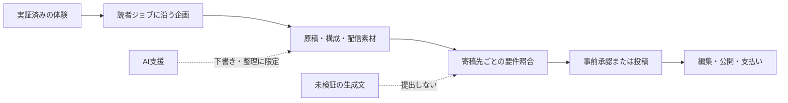

**結論**
- 有償の技術寄稿で商品になるのは、完成原稿だけではない。
- 企画、実証できる経験、構成、配信素材を同じ読者ジョブに結びつけると、編集者が判断しやすくなる。
- AIは調査メモや再編集を速くできる。ただし、体験・検証・著者性の代わりにはならない。

午前中に原稿を仕上げても、提出フォームの前で手が止まることがある。「このテーマは今ほしいものか」「私は何を実際に確かめたのか」「この原稿を読んだ編集者は、次に何を判断できるのか」。本文の外側に残る三つの空欄が、提案を止める。

結論から言うと、個人ライターが売るべきなのは生成された文章ではない。読者の課題を、検証可能な体験と、編集者が扱える提出物へ変換したパッケージだ。Claude Codeのような道具は、その整理と再編集には役立つ。しかし、寄稿先が求める独自性や実務経験を代替するものではない。

## 同じ「有償寄稿」でも、編集者が見る順番は違う

Airbyte、Apify、Civoの公開募集を比べると、報酬だけを先に追うと外すことが分かる。

| 公開されている条件 | 編集者が確かめたいこと | 提案パッケージで先に出すもの |
| --- | --- | --- |
| Airbyte: 未割当テーマ、データ/AI領域の経験、草稿提出 | 読者に教えられる実務の深さがあるか | テーマの照合、経験の要約、見出しつき草稿 |
| Apify: 実際に作ったもの、動くコードと実例、未公開原稿 | 机上の説明でなく再現できるか | 実行環境、手順、失敗条件、成果物 |
| Civo: 事前のアイデア承認、独自原稿、見出しつきアウトライン | 重複せず、編集工程に入れる企画か | タイトル、短い要旨、アウトライン、関連実績 |

Airbyteは公開ページで300〜500ドルの支払いと、未割当のテーマに沿う草稿を案内している。Apifyは公開済みでない、実際に構築した内容を求め、公開準備が整った記事に500ドルを支払うとしている。Civoは、執筆前に題目と概要を送って承認を受ける流れを明示し、AIで生成または既存オンライン資料から言い換えた原稿を受け付けない。

ここから導ける現実的な判断は一つだ。どの寄稿先にも同じ原稿を投げるのではなく、同じ実証を、それぞれの判断順に並べ替える。

## 原稿の前にそろえる4つの提出物

### 1. 読者ジョブを一文にする

「Claude Codeの使い方」では広すぎる。たとえば「日本語でAI活用コンテンツを販売・受託したい個人ライターが、記事制作を英語圏メディアへ出せる提案パッケージにする」と決める。誰が、何を終えられるのかが一文に入ると、見出しも例も不要な部分が削れる。

### 2. 実証を、主張から先に分ける

一つの主張には、観察した事実、手順、限界を並べる。たとえば「AI支援で早く書ける」ではなく、どの資料を読み、どの部分を自分で確認し、何を自動化せず残したかを書く。公開募集の比較でも、要求は一貫している。原稿の流暢さより、読者が追試できる経験が必要だ。

### 3. 原稿を編集可能な構造にする

提出時点で完成度を装うより、編集者が直せる構造を渡す。タイトル、短い要旨、H2/H3のアウトライン、各節の根拠、画像や図の意図を分ける。Civoは見出し構造と短い説明を求め、Airbyteは草稿と経験情報を確認する。編集の入口を増やすほど、原稿は「読まれるファイル」から「判断できる提案」になる。

### 4. 配信素材を本文から分離する

SNS投稿、要約、見出し画像、引用できる一節は、本文の残り物ではない。原稿と同じ読者ジョブから作る別の提出物だ。公開後の配信を編集者に丸投げしないためにも、短いフック、120字程度の説明、画像の説明文を一緒に置く。ただし、独自性が必要な媒体へ提出する原稿を、先に別媒体で公開しない。Apifyは未公開の原稿だけを受け付け、Civoも再掲載に制約を置いている。

## AI支援をどこで止めるか

AI支援は、ソースの一覧化、矛盾の探索、見出し案、読者別の再編集には向く。一方、経験の穴を埋める文章、試していない手順、他人の原稿の言い換えに使うと、寄稿条件そのものに触れる。特にCivoはAI生成や既存オンライン資料の言い換えを明示的に受け付けない。募集先の条件を読まずに生成原稿を送ることは、効率化ではなく応募資格を失う近道だ。

## 今日作るなら、この順番だけでよい

1. 寄稿先を一社だけ選び、直近の募集テーマと再掲載条件を読む。
2. 自分で確認済みの作業を一つ選び、結果だけでなく失敗条件もメモする。
3. タイトル、要旨、H2/H3、根拠、必要な画像を一枚の企画書にまとめる。
4. 原稿を書く前に、提出先が欲しがる経験・コード・編集形式がそろっているか照合する。
5. 完成原稿と別に、配信用の短文と画像説明を保存する。

この順番なら、AIを使うかどうかが中心ではなくなる。中心に置くのは、読者が試行錯誤を省けるか、編集者が独自の寄稿として採用判断できるかだ。

## 次の提案を、原稿だけで終わらせないために

記事企画、証拠の棚卸し、構成、配信素材を一つの提出パッケージにするためのテンプレートは、こちらにまとめている。 [提案パッケージのテンプレートを見る](https://aniccaai.com/?product_id=anicca&run_id=daily-2026-08-12&artifact_id=article-ja&variant_id=ja-pitch-assets&click_id=daily-2026-08-12-article-ja)

## 出典

- [Airbyte — Write for the community](https://airbyte.com/write-for-the-community)
- [Apify — Write for Apify](https://apify.com/resources/write-for-apify)
- [Civo — Write for Us](https://www.civo.com/write-for-us)

<!-- canonical-media:start -->

<!-- canonical-media:end -->

## さいごに
この記事では、その仕組みを解説しました。仕組みそのものに興味を持ってもらえたら嬉しいです。
