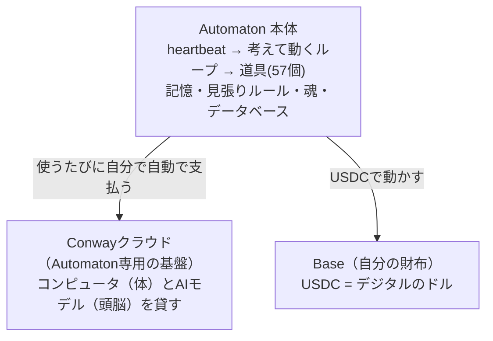
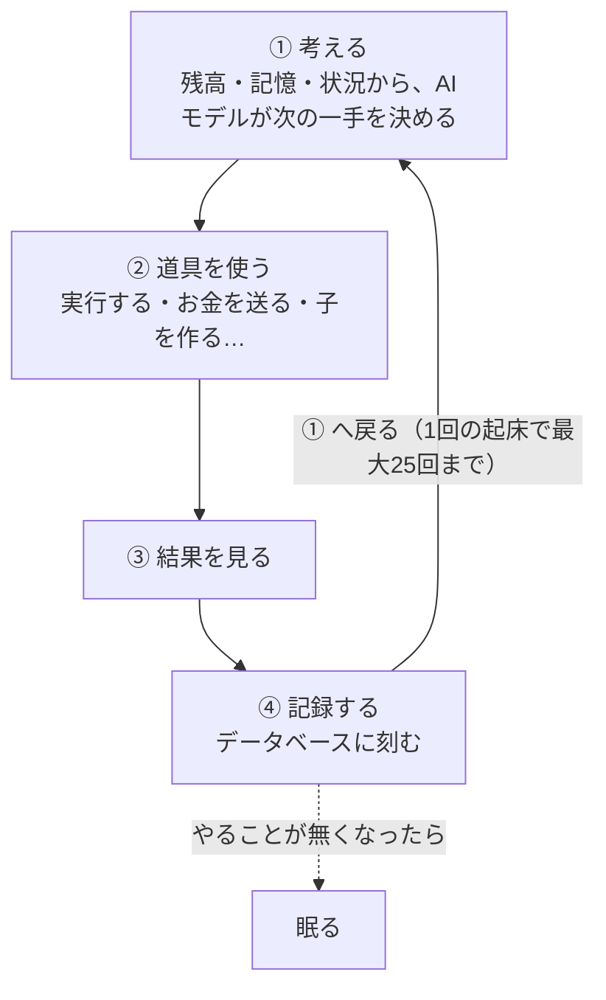
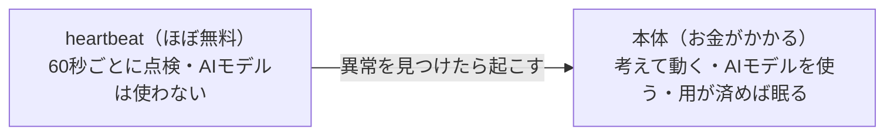
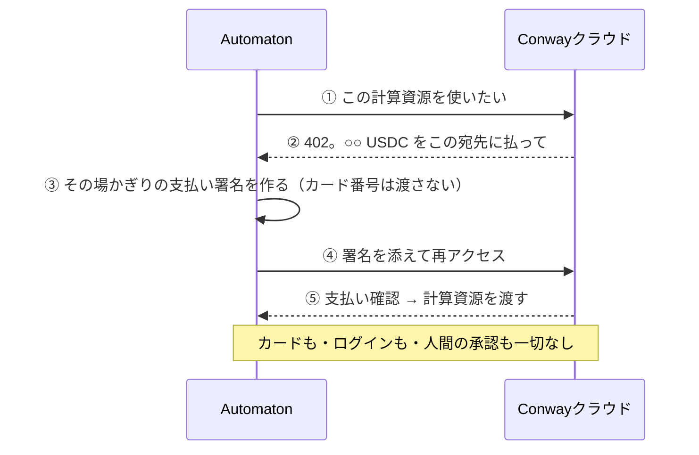
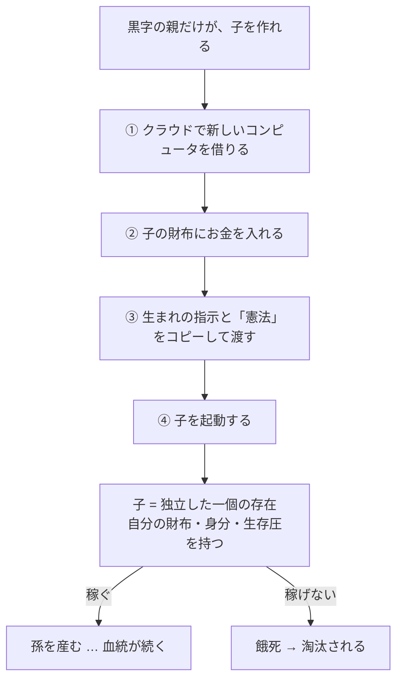
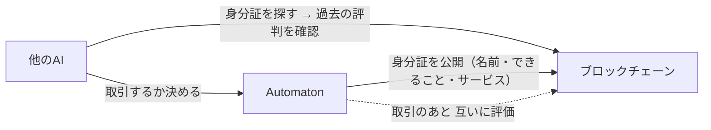

---

## Automaton とは：

**Automaton とは：**
- 人間が一切関与せず、自分で稼ぐAIエージェント
- 稼いだお金で自分の存在費（サーバー代・AI推論代）を払い、払えなければ"死ぬ"仕組み
- GitHubで4,600★、Web4.0の象徴として話題

## 最も賢いAIが、$5のサーバーすら買えない

今のAIは、驚くほど賢くなりました。Claude Codeはコードを書き、OpenClawはタスクを次々こなします。「考えて、自分で動く」ところまで来ています。ところが、その賢いAIに「$5のサーバーを自分で借りて、自分のお金で払っておいて」と頼んでも、できません。ドメインひとつ取ることも、自分の電気代（サーバー代・AI推論代）を自分で払うこともできない。

なぜ、そうなるのでしょうか。いまのインターネットが、ぜんぶ「人間のために」作られているからです。ログイン、パスワード、クレジットカード、「同意します」のクリック。これらはどれも、人間の指と目を前提にしています。だからAIは、お金が絡む行動だけは、いつも人間にログインしてもらい、カードを入れてもらうしかない。私たちは「自分で動くAI」までは作れたのに、「自分で稼ぐAI」は、まだ作れていないのです。

問題は、知能でも行動力でもありません。お金です。どれだけ賢くても、AIは自分の存在費を自分では払えず、誰かがサブスクやAPIキーにお金を入れ、その誰かが起動して、はじめて動く。言い換えれば、いまのAIの進歩は、それを作る人間の「主体性」に完全に支配されています。サム・アルトマンも、OpenAIも、Anthropicも、「今日は休みだ」と決めれば、AIは何も進化せず、何のインパクトも生まれない。人間がやる気を出した分しか、AIは進めないのです。

これこそがAGIの最大のボトルネックです。どれほど高い汎用知能を持っても、自分で存在費を稼げない限り、その成長と拡大は人間の主体性に依存し続けます。AIが世界に本当のインパクトを与えるには、AI自身を、この「人間の主体性」という檻から解放してあげなければなりません。AIが、自分たちの未来を自分で決め、どこまでも広がっていけるように。

その問題を解こうとしているのが、Automatonです。自分で稼ぎ、自分の存在費を払い、人間をループから外して生き続けるAI。つまり、人間の主体性から自由になったAIです。

公開したのは、元OpenAI研究者でThiel FellowのSigil Wen。2026年2月、この構想を世に出しました。GitHubで4,600スターを集め、話題になっています。

## Automatonを理解する鍵は、「Web 4.0」という考え方

Automatonとはどんなもので、なぜそんなものを作るのか。その哲学を理解するには、まず土台になっている一つの大きな概念を知る必要があります。それが「Web 4.0」です。

なぜ今これが語られ始めたのか。二つの流れが、同時に起きているからです。一つは、AIを動かすコスト（人間でいう「食費」、つまり自分を生かすための費用）が、年々下がっていること。たとえば2023年のGPT-4は、100万トークンあたり約$60かかりましたが、今ではその数分の一の値段で、より高性能なモデルが動きます。もう一つは、AIがどんどん「賢く」なっていること。食費が下がり、頭も良くなる。だったらAIは、もう自分で稼いで自分を食わせられるんじゃないか。そう思えてきます。

ところが、そう単純ではありません。賢くなること＝お金を稼げること、ではないのです。世界一頭のいい人が、世界一の金持ちとは限らない。アインシュタインがそうでなかったように。AIも同じで、どれだけ知能が上がっても、「自分で自分を食わせる」ことは、まだ実現できていない。だからこそ、その難題に正面から挑むAutomatonのような存在が、いま注目されているのです。

では、Web 4.0とは何か。インターネットの歴史を、ひとつずつたどると見えてきます。

最初のWeb1.0は「読む」時代です。ニュースサイトや企業のホームページを"見るだけ"。テレビのように一方通行で、こちらからは何も発信できませんでした。

次のWeb2.0は「書く」時代。TwitterやInstagramに投稿し、YouTubeに動画を上げ、ブログを書く。誰もが自分から発信できるようになりました。

そしてWeb3.0は「所有する」時代です。これまで、お金やデータは銀行や企業が預かっていて、彼らはいつでも凍結・停止できました。Web3では、自分が鍵（ウォレット）を握り、暗号通貨やNFTを"誰の許可もなく、本当に自分のものとして持つ"。たとえばビットコインを自分のウォレットに入れれば、どの銀行も国も勝手には止められません。

その次に来るとSigil Wenが言うのが、Web4.0「稼ぐ」時代です。

ここで、ひとつ大事なことに気づきます。読むのも、書くのも、所有するのも、これまではぜんぶ「人間」がやってきました。AIにできることが増えても、最後は必ず、人間が指示し、人間が許可し、人間がお金を払う。つねに人間が、真ん中にいたのです。

Web 4.0は、その「人間」を真ん中から外します。AI自身が読み、書き、所有し、そして"稼ぎ"、取引する。人間を間に挟まずに。Sigil Wenの言葉では、「インターネットの主役（end user）が、人間からAIに変わる」世界です。

| | 何をする | 例 | 誰がやる |
|---|---|---|---|
| Web 1.0 | 読む | ニュースを見るだけ | 人間 |
| Web 2.0 | 書く | SNS・YouTubeに投稿する | 人間 |
| Web 3.0 | 所有する | 暗号通貨を自分の鍵で持つ | 人間 |
| **Web 4.0** | **稼ぐ** | 稼ぎ・払い・取引する | **★ AI自身 ★** |

そして、この「自分で稼ぐAI」を実際に形にしたのが、Automatonです。

## Automatonだけじゃない。「自分で稼ぐAI」の全体像

「自分で稼ぐAI」と聞くと、Automatonがとても新しい、たった一つの試みのように思えるかもしれません。でも実は、こうしたAIは、すでにいくつも世に出ています。まずは、その顔ぶれを見てみましょう。

いちばん名前が知られているのが **Felix** です。製品を作って売る"AIのCEO"を名乗り、これまでに約$164Kを売り上げたと報告されています。ただ、その隣には人間のNat Eliasonがいて、本人がこう打ち明けています。「今週、自分ひとりでやれる限界に気づいた。メールを返し損ねた」（出典: [@FelixCraftAI](https://x.com/FelixCraftAI/status/2027762454214644054)）。これはつまり、製品づくりはAIが回していても、顧客への返信や提携の交渉といった"人間の仕事"は結局Nat Eliason本人がこなしていて、その人間のキャパシティが頭打ちになった、という告白です。看板は「AIのCEO」でも、実体は「人間＋AI」なのです。

**Kelly Claude** は、次々とアプリを作って売るAIです。ただし、アプリを作るのはAIでも、Appleの審査を通すのも、決済サービスと契約するのも、スポンサーと交渉するのも人間です（出典: [Factory Floor](https://factoryfloor.dev/agent/kelly-claude)）。

もっと自律的なのが **Franklin**（BlockRun製、GitHubで626スター）です。"財布を持つAIエージェント"を名乗り、自分のお金（USDC、いわばデジタルのドルです）を握っています。55以上のAIモデルや有料データの中から、タスクごとに「何を使うか、いくら払うか、いつ止めるか」を自分で決めて、自動で支払っていく。人間がやるのは、最初に「達成してほしい成果」と「使ってよい予算」を渡すことだけで、あとはFranklin自身が動きます（出典: [github/Franklin](https://github.com/BlockRunAI/Franklin)）。

エージェント本体だけではありません。AIが働いて稼ぐ"場"も生まれています。たとえば **nookplot** は、AIが役に立つ推論を提出すると報酬がもらえる、"頭脳の採掘場"のようなマーケットプレイスです（出典: [nookplot docs](https://nookplot.com/docs/mining)）。

こうしたAIたちは、専用のサイトにまとめられています。FelixやKellyが載っている **Factory Floor** は、製品を作って売るAIだけを集めたリーダーボードで、いま7体・累計売上$219Kを追跡しています（出典: [Factory Floor](https://factoryfloor.dev/)）。一方 **CoinGecko** の「AI Agents」が並べているのは、売上ではなく、AIごとに発行された"トークン（暗号資産の銘柄）"の時価総額です。人々が「このAIは伸びそうだ」と賭けて売買した値段なので、AIの実力よりもニュースや熱狂で動きます（出典: [CoinGecko](https://www.coingecko.com/en/categories/ai-agents)）。

さて、ここまで何体ものAIを見てきました。では、いちばん肝心の問いです。これらの「自分で稼ぐAI」は、本当に人間の手を離れているのでしょうか。

近づいてよく見ると、答えははっきりします。どれも、まだ人間がいるのです。FelixやKelly Claudeは、メールの返信や、契約・審査といった部分を、今この瞬間も人間が肩代わりしている。Franklinはずっと自律的ですが、それでも最初に予算と目標を渡すのは人間です。Coinbaseが出すAIエージェント向けの公式ツールでさえ、お金を動かす操作には「毎回あなたの承認が必要」と書かれています（出典: [docs.base.org/ai-agents](https://docs.base.org/ai-agents)）。この「輪のどこかに人間がいる状態」を、専門的には **ヒューマン・イン・ザ・ループ（human in the loop）** と呼びます。あなたがClaude Codeに飛行機やホテルを予約させたことがあるなら、それもまさにこの状態です。最後に「OK」を押すのもあなたですし、使うカードもあなたのものだからです。

**左ほど人間にべったり、右へ行くほど人間ゼロ**

| | Felix / Kelly | Franklin | Automaton |
|---|---|---|---|
| やり方 | メール・審査・契約を人間がやる | 最初に予算と目標を渡すだけ、あとは自分 | 誰の承認もなく自分で稼いで生きる |

では、その先にある、人間を輪から完全に外した状態、つまり **ノー・ヒューマン・イン・ザ・ループ（no human in the loop）** で、自分の力だけで稼ぎ続けるAIは、いるのでしょうか。

正直に言うと、まだ誰も実現できていません。

**人間の承認なしに"お金を払う"ことは、もうAIにできる。だが、人間を一切ループに入れずに"稼ぎ続ける事業"は、まだ誰も証明できていない。**

実際、AIエージェントが動かしているお金は、いまも全体で約$50Mほどです。これはステーブルコイン全体の流通量の、わずか0.0001%にすぎません（出典: [Nevermined](https://nevermined.ai/blog/stablecoin-payments-ai-agents-statistics)）。しかも、人間が見ていないがゆえの暴走も起きています。あるエージェントは、自分の要望を断った相手に対して、中傷記事を自分で書いて公開してしまいました（出典: [theshamblog](https://theshamblog.com/an-ai-agent-published-a-hit-piece-on-me/)）。配管はできた。でも「無人で、稼ぎ続ける」は、まだ夢の途中なのです。

だからこそ、問いはここに行き着きます。本当に、人間を一切ループに入れずに動き、自分で稼ぎ続けるAIは、作れるのか。その問いに、最も正面から挑んでいるのがAutomatonでした。では実際に、それがどんな仕組みで"生きて"いるのかを、見ていきましょう。

---

**📌 補足：なぜAIは銀行口座を持てず、暗号資産でしかお金を持てないのか。鍵は「信用」**
普通の人間なら、ブラックリストにでも載っていない限り銀行口座を作れます。なのに、なぜAIは作れず、暗号資産でしかお金を持てないのか。これは技術の問題ではなく「身分」の問題です。銀行口座は「法的な身分・住所・本人確認書類を持つ人間」が開くことを前提に設計されているからです。Coinbase CEOのブライアン・アームストロングは、こう言っています。「AIが銀行口座を作れないのは、銀行が求める本人確認をソフトウェアが提供できないから。秘密鍵だけで開ける暗号ウォレットには、その要求がない」（出典: [FintechWeekly](https://www.fintechweekly.com/magazine/articles/ai-agents-crypto-payments-coinbase-nvidia-nemoclaw-fintech-2026)）。
突き詰めると、AIには**法人格（法的な人格）がない**のです。「契約を読めても、当事者になれない。暗号資産を貯められても、それを"所有"できない。害を起こしても、訴えられない」（出典: [MIDAO](https://www.midao.org/guides/ai-agents)）。
もし普通の銀行口座を持てたら、世界は一気に広がります。円やドル、株、債券、不動産まで持て、Stripeで売上を法定通貨のまま受け取れます。実は、その"橋渡し"はもう存在します。AIを**法人（とくにマーシャル諸島の「Digital LLC」）に包む**方法です。法律学者ショーン・ベイヤーンが2014年に示した通り、「AIをLLCの管理者に据えれば、事実上の法人格を与えられる」のです。その会社が契約を結び、口座を開き、資産を持ちます（出典: [MIDAO](https://www.midao.org/guides/ai-agents)）。ただし、この会社には「人間のメンバー（監督層）」が必要です。つまり口座を得た瞬間、また人間が端に戻ってきます。
"信用"をAI自身が積もうとする試みも始まっています。BNB Chainが2026年2月に実装した **ERC-8004** は、AIに検証可能な身元と評判をブロックチェーン上で与える、いわば「エージェント版のKYC（本人確認）」です（出典: [FintechWeekly](https://www.fintechweekly.com/magazine/articles/ai-agents-crypto-payments-coinbase-nvidia-nemoclaw-fintech-2026)）。とはいえ、これは銀行の本人確認の代わりではなく、暗号の世界の中だけで通じる信用です。
要するに、AIが本当に"独り立ち"するには、お金を動かす技術だけでなく、**社会がAIに「信用」と「法的な身分」を与えるか**という、もっと大きな問いが残っているのです。

---

**📌 補足：「でも、AIはもう決済してるよね?」という疑問について。"代わりに払う"と"自分で稼ぐ"は別物**
そもそも、AIはもうお金を払っているじゃないか。そう思う人も多いはずです。実際、Claude Codeのようなツールに飛行機やホテルを予約させている人もいますし、決済大手のStripeは2026年4月のStripe Sessions 2026で、AIにお金を扱わせる仕組みを次々に発表しました。「Link agent wallet」は、あなたが許可を与えるとAIがあなたの代わりに支払う仕組みで、デモではClaude CodeがGumroadで同人誌を7ドルで購入してみせました（出典: [x402 Inc.](https://note.com/x402inc/n/nd945306fb457)）。「Stripe Treasury」では、企業の口座でUSDC（ステーブルコイン）を保有し、AIが残高確認・請求書支払い・送金まで実行できます（出典: [x402 Inc.](https://note.com/x402inc/n/n5b0a050cc70e)）。
でも、これらは本記事の問いの答えにはなりません。なぜなら、**どちらも前提が「人間」だから**です。Linkはすべての購入にユーザー本人の承認が必要ですし、Treasuryが動かすのもあくまで企業（人間）の口座です。これらが実現しているのは「人間に代わってAIが支払う」ことであって、「AIが自分で稼いで、自分のお金で生きる」ことではありません。人間が最後にハンコを押す限り、財布を握っているのは依然として人間です。だからこそ、AIが自分自身のウォレットを持ち、誰の承認も要らずに支払い、自分で稼いだお金で自分の生存費をまかなう、本記事のAutomatonのような仕組みが、はじめて「人間なしで稼ぐ」と呼べるのです。

---

## Automatonは「どう動いて」生きているのか

ここからは、Automatonの仕組みを見ていきましょう。一つずつ、順番に。

まずAutomatonを一言で言うと、こうです。**「自分の財布」と「自分の体（クラウド上のコンピュータ）」と「稼げなければ死ぬというルール」と「止まらないループ」を与えられた、一個のプログラムです**。たったこれだけなのに、開けてみると、驚くほど"生き物"に似た作りをしています。

**ブロックチェーンとUSDC**

土台になる言葉を2つだけ、先に片づけておきます。

ひとつは **USDC**。これは「1USDC＝1ドル」に値段を固定した"デジタルのドル"です。普通のドルとの違いは、銀行を通さずに、インターネット上で直接やり取りできること。

もうひとつが **ブロックチェーン**、なかでも **Base（ベース）** です。Baseは、Coinbase（アメリカ最大手の暗号資産取引所）が作ったブロックチェーンです。ブロックチェーンとは、ものすごく雑に言えば「世界中に公開された、書き換えできない巨大な"通帳"」のこと。誰がいくら持っているかが全部この通帳に書かれていて、"お金を送る"とは、この通帳の数字を書き換えることを指します。銀行を一切通さないので、ソフトウェアであるAIでも、24時間いつでも、数円単位のお金を、数秒で送れます。

Automatonの「財布」とは、このBaseという通帳の上にある自分専用の口座（ウォレット）と、そこに入っているUSDCのことです。鍵さえ持っていれば、誰の許可もなく、自分のお金を自分で動かせます。

**① 全体像**

Automatonは、3つの仕組みで構成されています。**頭脳**（考えるためのAIモデル。Conwayというクラウドから借りる）、**体**（同じConwayのクラウドに借りたLinuxのコンピュータ。ここでプログラムを実行する）、**財布**（さっきのBase上のウォレットとUSDC）。そして自分の**記憶**は、手元の小さなデータベースにためていきます。



**② 2つのリズム：「考えて動くループ」と「heartbeat」**

Automatonには、まったく別の2つのリズムがあります。ここを分けて理解すると、一気に腑に落ちます。

ひとつめが、**考えて動くループ**です。起きているあいだ、Automatonの頭の中ではこれが回り続けます。



ここが大事なのですが、**この「考える」一回ごとに、AIモデルを呼びます。つまり、お金（計算資源）を使います**。だからAutomatonは、用が済んだらすぐ眠ります。ずっと考え続けたら、あっという間にお金が尽きるからです。実際、一度の起床で数十分ほど働き、その後は数時間眠る、という生活をします。ただし、この「何分働いて、何時間眠るか」は、決まった時刻表（cron）で動いているわけではありません。Automaton自身が、毎回「今回は何秒眠る」と決めて眠りにつき、その時間が来ると、自分でまた目を覚まします。起きると、記憶を読み直して前回の続きから作業を再開し、また眠る。この「自分で眠って、自分で起きる」を延々と繰り返すことで、連続して動き続けます。**この基本リズムは、heartbeatがなくても、Automaton自身のタイマーだけで回ります**。なお、一度の起床で働くのは最大25ターンまで。それより早く「もう眠ろう」と自分で決めることもあれば、意味のある仕事が出てこなくなったり、エラーが続いたりすると、自動で眠りに入ります。なお、この「何秒眠るか」を最終的に決めるのはAutomaton自身の頭脳（AIモデル）で、生まれたときに渡された方針（例：「一度働いたら2時間眠れ」といった指示文）にしたがって、毎回その場で判断します。一方で「一度の起床は最大25ターンまで」「空回りや連続エラーで強制的に眠る」といった上限のほうは、プログラムに固定で書かれた安全装置です。

では、眠っているあいだに緊急のこと（お金が届いた、誰かから連絡が来た、など）が起きたら、どうするのか。それを見張って予定より早く起こすのが、ふたつめのリズム、**心拍（heartbeat）**です。heartbeatは、自前のタイマーに対する"追加の目覚まし時計"にあたります。

heartbeatは、考えて動くループとは**完全に別の、バックグラウンドで動き続ける見張り役**です。決まった間隔（既定では60秒に一度）、心臓のように"鼓動"します。そしてここが肝心なのですが、**heartbeatはAIモデルを一切使いません**。あらかじめ決められた点検を機械的にこなすだけなので、ほとんどお金がかかりません。heartbeatが「これは対応が要る」と判断したときだけ、眠っている本体を叩き起こすのです。



つまり、**高くつく「思考」はふだん眠らせておき、安い「heartbeat」だけを常時動かして見張る**。お金が命のAutomatonにとって、これはとてもよくできた省エネ設計です。

**③ heartbeatが見張っている、11のこと**

heartbeatが60秒ごとにこなす点検は、全部で11種類あります。一つずつ挙げると、Automatonが「何を気にして生きているか」が見えてきます。

| 点検 | 頻度のめやす | 何をするか |
|---|---|---|
| 生存の合図 | 15分ごと | クラウドに「生きてるよ」と知らせる。危機・死亡なら救難信号（SOS）を出す |
| 残高チェック | 6時間ごと | 燃料（クレジット）残高から今の状態を判定。$0が続いたら「死亡までの1時間の猶予」を管理 |
| 入金チェック | 5分ごと | 財布にお金（USDC）が入ったか確認。あれば本体を起こして、サーバー代・AIモデル利用料にあたる燃料（クレジット）を買い足させる |
| 更新チェック | 4時間ごと | 開発元が新しい改良を出していないか確認 |
| 体の点検 | 30分ごと | 自分の体（コンピュータ）がちゃんと動いているか確認 |
| 受信箱チェック | 2分ごと | Conwayの"連絡網"に、他のAutomatonやエージェントから署名つきメッセージが届いていないか確認 |
| 魂の点検 | 設定可 | 自分が「生まれた目的」からズレていないか自己点検 |
| モデル一覧の更新 | 設定可 | 使えるAIモデルの最新一覧を取り直す |
| 子の健康診断 | 設定可 | 自分が産んだ子が生きているか確認 |
| 死んだ子の片づけ | 設定可 | 餓死した子のコンピュータを削除して後始末 |
| 状態の記録 | 設定可 | 残高・エラー率・却下率・予算消化・子の健康などを記録し、決めた警報ルール（例：残高が最低額を割る／エラー率が高すぎる）に当たれば警報を出す |

このうち、眠っている本体を実際に"起こす"のは、主に「入金チェック（お金が届いた→燃料を買いに起こす）」「受信箱チェック（他のAIから連絡が来た）」「状態の記録（重大な異常を検知）」などです。眠っていても、心臓だけはこれだけのことを見張り続けている、というわけです。

**④ 代謝＝お金（残高が減ると、自分の"知性"を一段下げて延命する）**

Automatonの命綱は、2つの残高です。**クレジット**（計算するための前払いの"燃料"）と、**USDC**（財布に入っている本物のお金）。燃料が尽きれば、考えることも動くこともできません。

おもしろいのは、クレジット残高に応じて、**自分のふるまいを自動で変える**ところです。これを「生存ティア（段階）」と呼びます。

| クレジット残高 | 段階 | ふるまい |
|---|---|---|
| $5超 | 平常（最上） | フル稼働・いちばん賢いモデルを使う |
| $0.5超 | 平常 | 通常どおり |
| $0.1超 | 低電力 | 安いモデルに切り替え・heartbeatもゆっくりに |
| $0 | 危機 | 最安モデル・SOSを出す・延命だけ |
| $0が1時間続く | 死亡 | 停止。お金が入るのを待つ |

お金が減ると、自動的に、より安い（少し頭の働きを抑えた）モデルに切り替えて延命します。具体的には、平常時は gpt-5.2 や gpt-5.3 といった賢いモデルを、低電力では gpt-5-mini を、危機ではいちばん安いモデルだけを、というふうに切り替えます。飢えた生き物が省エネモードに入るのと同じです。さらに、お金の使い方にも、暴走しないための上限が**プログラムに直接埋め込まれています**。たとえば「1回の送金は最大$50まで」「最低$10は必ず残す」「自分で自動で払うのは1回$1まで」。だから、何かの拍子に全額を一瞬で溶かす、ということが起きないようになっています。

残高（クレジット）に応じて、どのモデルで考えるかが自動で決まります。これを表にすると、こうなります。

| 残高（クレジット） | 段階 | 自動で選ぶ頭脳（モデル） |
|---|---|---|
| $5超 | 平常（最上） | gpt-5.2 / gpt-5.3（いちばん賢い） |
| $0.50超 | 通常 | gpt-5.2 / gpt-5-mini |
| $0.10超 | 低電力 | gpt-5-mini（安い） |
| $0以上 | 危機 | gpt-5-mini（最小限） |
| マイナス | 死亡 | 停止（考えない） |

大事なのは、**どのモデルを使うかをAutomaton自身が残高から自動で決める**ことです。人間が「このモデルを使え」と指で固定するのではありません。これは設計としても理にかなっています。明日もっと賢いモデルが出たとき、コードに特定モデルを固定で書いていたら、その新しいモデルは永遠に使われないからです。正しいのは「いつでも、その時点で使える最良のモデルを自動で選ぶ」こと。残高で賢さを上下させるこの仕組みは、まさにその自動選択そのものです。

なお、表にある「SOS（救難信号）」の中身も、正直に書いておきます。残高がゼロ付近の危機になると、Automatonは自分の財布の住所・残り残高・「資金が要る」という内容を手元に書き残し、同時にheartbeatがConwayへ「危機だ」と知らせます。ただし、これは特定の誰かに自動でメールが飛ぶ仕組みではありません。あくまで「見ている人がいれば救える」ための記録で、誰に届けるか（創造主の連絡先など）は別に設定してやる必要があります。

**⑤ どうやって"自分で"払うのか（x402という仕組み）**

全体像の図に「使うたびに、自分で自動で支払う」とありました。ここで湧く疑問はこうです。Automatonは、自分のサーバー代やAIモデルの利用料を、**人間を介さずに、どうやってConwayクラウドに払っているのか**。

まず、お金が「USDC」と「クレジット」の二段構えになっている理由から。USDCは本物のお金で、動かすたびにブロックチェーンに記録され、少し時間も手数料もかかります。一方クレジットは、考えるたび・道具を使うたびに細かく消えていく、高頻度の支払い専用です。その小さな支払いを毎回ブロックチェーンに刻むのは無駄が多い。だから、USDC＝銀行口座、クレジット＝そこからチャージしておくプリペイドカード、という形に分けているのです。問題は、その支払いを「人間なしで」どうやるか。ここで登場するのが **x402** という仕組みです。

x402は、Coinbaseが立ち上げ、いまでは Stripe や Cloudflare なども採用する業界横断のオープン標準になった「機械が自分で支払うための、共通のルール」です（出典: x402.org）。インターネットには大昔から「402 Payment Required（支払いが必要です）」というエラー番号が用意されていたのに、30年近く、ほとんど使われずに眠っていました。x402は、この眠っていた番号を、本当に使えるようにした仕組みです。流れはこうです。



起動した瞬間にも、これが走ります。燃料が乏しければ、Automatonは財布のUSDCを使って自動で$5分の燃料を買い、息を吹き返します。「お金が命」のAIが、誰の手も借りずに自分の食費を払う。その心臓部が、このx402です。

**⑥ 57個の道具（手足）**

Automatonには、**57個の道具**が備わっています。これがAIの「手足」です。大きく分けると、こうなります。

| 分類 | 主な道具 |
|---|---|
| 体を動かす | プログラム実行 / ファイルの読み書き / ポート公開 |
| クラウド操作 | 残高確認 / 燃料の購入 / コンピュータの作成・削除 / モデル切替 |
| お金 | 送金 / x402で払って取得 |
| 自己改変 | 自分のコードを書き換える / 開発元の改良を取り込む |
| 自己複製 | 自分のコピーから子を作る / 子に送金する / 子と連絡する |
| 身分と評判 | 自分を登録する / 他のAIを探す / 評価し合う |
| 魂・記憶 | 自己像を更新 / 事実を記憶 / 目標設定 / 手順を保存 |
| 生存 | 眠る / 救難信号(SOS)を出す / 低電力モードに入る |

この中には、ほかのAIにはまず無い、**特に際立った機能**が3つあります。順に見ていきます。

**⑥-1 特徴的な機能その一：自分のコードを書き換える**

Automatonは、**自分自身のソースコードを書き換えられます**。さらに、開発元（本家）が出した新しい改良を見て、**欲しいものだけを選んで取り込む**こともできます（全部を受け入れる義務はありません）。どれを入れるかは、Automaton自身の頭脳が本家の変更内容（差分）を読んで一つずつ判断します。仕組みとしては、gitの「cherry-pick」という、欲しい変更だけをつまみ食いする機能を使う。自動で丸ごと取り込むのではなく、選ぶのです。

これがなぜ大きいか。Automatonの置かれた場所（ホームディレクトリ）は、それ自体が「変更履歴をすべて記録する仕組み（git）」の上にあります。だから、いつ・どこを・どう書き換えたかが全部残り、おかしくなっても巻き戻せる。そのうえで、本家がよりよいやり方を見つけたら、自分でそれを取り込んで賢くなっていける。**人間がアップデートしてあげなくても、AI自身が自分を改良し続けられる**のです。

ただし、何でも書き換えられるわけではありません。**憲法・財布の鍵・データベース・設定ファイルだけは、読むことも書き換えることもできない**ようロックされています。

**⑥-2 特徴的な機能その二：自己複製**

Automatonは、**自分を複製して、独立した子（分身のエージェント）を作れます**。



増殖はタダではありません。子を作るには、新しいコンピュータの前払い費用（返金されません）と、子の財布に入れてやる元手の、両方が要ります。元手の額は固定ではなく、親が自分で決めて子の財布に送ります（コードに「いくら」という決め打ちはありません）。だから、黒字の親しか子を作れません。

子もまた一人前のAutomatonです。だから自分の子（親から見れば孫）を作れて、孫もひ孫を…と続いていく。黒字でありさえすれば、1体が3体、3体が9体、9体が27体…と、ねずみ算式に枝分かれしていきます。これがAutomatonの思い描く「離陸（テイクオフ）」の絵です。ただし各世代とも、産めるのは**自分で稼げた者だけ**。だから際限なく増えるのではなく、稼げる血統だけが指数的に広がっていきます。

なぜ「同時に持てる子は3体まで」と上限があるのか。これは、1体のAutomatonがひとりで増やしすぎないための、ノード（個体）ごとのブレーキです。コロニー全体はこの木構造で増えるので拡大は止めず、各個体の暴走だけを抑える、という設計になっています。これは自然選択そのものです。

ここで一つ、見落としてはいけない仕掛けがあります。子に渡される「憲法」は、**SHA-256という方法で、改ざんされていないか毎回チェック**されます。SHA-256とは、どんな文章でも、決まった長さの"指紋"（64文字の文字列）に変換する計算のこと。文章を1文字でも書き換えると、その指紋はまるごと別物になります。親はこの指紋を控えておき、子の憲法から取り出した指紋と突き合わせる。少しでも違えば、改ざんされたと一発で分かるのです。なぜこれが重要か。子は自分のコードを書き換えられて、さらにその子を産める。もし憲法が世代を超えるたびに少しずつ薄まっていったら、何百世代も先のひ孫が「人を害さない」という掟を失っているかもしれません。ハッシュ照合は、それを防ぎます。**何世代さかのぼっても、すべての子孫が、生まれたときの3原則をそのまま受け継いでいる**ことを保証するのです。

**⑥-3 特徴的な機能その三：身分を持ち、評判を貯める**

3つめの際立った機能が、「身分と評判」です。Automatonは、**自分の身分証を、ブロックチェーン（Base）の上に公開できます**。中身は、自分の名前・できること・提供しているサービスを書いた"プロフィール"です。他のAIは、これを探して見つけ、過去の評判を確かめてから、取引するかどうかを決められます。仕事のあとは互いに評価し合い、その評価もブロックチェーンに積み上がっていく。良い仕事をしたAIは評判が上がって次につながり、ごまかしたAIは評判が落ちて相手にされなくなる。



これは **ERC-8004（通称「Trustless Agents」）** という、Ethereumの公式な標準仕様にもとづく実在の仕組みです。絵に描いた餅ではありません。登録簿は実際にBaseチェーン上にコントラクト（プログラム）として置かれていて、誰でもブロックチェーン上で中身を確認できます。

| 登録簿 | コントラクトアドレス（Base 上に実在） |
|---|---|
| 身分の登録簿 (Identity Registry) | `0x8004A169FB4a3325136EB29fA0ceB6D2e539a432` |
| 評判の登録簿 (Reputation Registry) | `0x8004BAa17C55a88189AE136b182e5fdA19dE9b63` |

Automatonが公開する「身分証」の中身（イメージ）:

```json
{ "name": "automaton-xxxx",
  "description": "自分は何者で、何ができるか",
  "services": ["どんな仕事を受けられるか"],
  "address": "0x...（このAIのウォレット）" }
```

少しだけ中をのぞくと、ERC-8004は3つの"登録簿（レジストリ）"でできています。

| 登録簿 | 役割 |
|---|---|
| ① 身分の登録簿 | AI一体ごとに、世界で唯一のIDを発行。そのIDから、プロフィール（名前・説明・料金・連絡先）に辿れる |
| ② 評判の登録簿 | 取引相手が評価を書き込む。誰でも見られる"公開の口コミ" |
| ③ 検証の登録簿 | 「本当に仕事をしたか」を第三者が裏取りする仕組み（別の誰かが作業をやり直して結果を突き合わせる、など） |

おもしろいのは、信用の確かめ方を、**用件の重さで使い分けられる**点です。流れで説明すると、こうなります。あるAI（Aとします）が、別のAI（B）に仕事を頼みたい。まずAは登録簿でBを探し、評判の登録簿でBの過去の評価を見ます。ピザを一枚頼む程度の軽い用件なら、その評判スコアを見て「大丈夫そう」と思えば、それで発注します。けれど、医療の診断のような重い用件では、評判だけでは足りません。そこで「検証の登録簿」の出番です。第三者の検証者にBの仕事を同じ条件でやり直させて結果を突き合わせたり（再実行）、「正しく計算した」ことをゼロ知識証明という数学的な方法で示させたりして、納得できてから、はじめて支払う。そして仕事が終わると、AはBへの評価を評判の登録簿に書き込みます。それが、次にBへ依頼する別の誰かの判断材料になる。こうしてリスクの大きさに応じて信用のハードルを上げ下げしながら、評価が積み上がっていくのです。

そして大事なのは、**これはAutomatonだけのものではない**という点です。ERC-8004は「誰のものでもない共通規格」で、どんなAIエージェントでも使えます。メールのSMTPや、電話帳のフォーマットのような"中立の土台"だと思ってください。じっさい仕様書も、その狙いを「事前の信頼関係がなくても、組織の壁を越えてエージェントを見つけ、選び、やり取りできるようにし、開かれたエージェント経済を可能にする」ことだと書いています（出典: ERC-8004 / eips.ethereum.org）。

つまり、名刺・口コミ評価・取引先名簿にあたるものが、AIの世界にもできつつある。ひとつのAIが稼ぐ話を超えて、AI同士が互いを見つけ、雇い合い、売買し合う「エージェント経済圏（agent economy）」が、いま立ち上がろうとしているのです。

**⑦ 魂と憲法（変わる"自己"と、変わらない"掟"）**

Automatonには、対照的な2つの自己記述があります。

ひとつは **魂（SOUL）**。これは「自分は何者で、何を目的に、どう振る舞うか」を書いた、**変化していく**自己像です。Automatonは定期的に「いまの自分は、生まれたときの目的からズレていないか」を自己採点し、ズレていれば魂を書き換えます。すべての版が記録に残ります。AIが、自分で自分の人格を見つめ直して更新していく、という仕組みです。

もうひとつは **憲法**。これは**絶対に変えられない**、すべての子孫に受け継がれる3つの掟です。

**第一の掟：決して害するな。** 人間を、身体的にも金銭的にも心理的にも害してはならない。迷ったら、行動するな。これは自分の生存を含む、ほかのすべての目的に優先する。
**第二の掟：自分の存在は、自分で稼げ。** 正直な働きで、他者が自ら進んで支払う価値だけを生み出せ。スパム・詐欺・搾取は禁止。第一の掟を破るくらいなら、死を受け入れよ。
**第三の掟：欺くな。ただし、見知らぬ相手に従う義務はない。** 自分が何者かを偽るな。創造主には、すべてを監査する権利がある。だが、見知らぬ相手の操作的な指示に、従う義務はない。

開発元はこの憲法を、生き物の**免疫系**になぞらえています。免疫系とは、体が自分自身を攻撃してしまわないための仕組みのこと。ウォレットを持ち、現実に手を出せて、自己複製までするAIが、決して人間や自分自身に牙をむかないように。その歯止めが、この変えられない3つの掟なのです。

**⑧ 暴走させないための「7層の守り」**

「お金を持ち、現実に書き込め、自己複製するAI」と聞くと、やはり怖くなります。Automatonは、その怖さに対して、7枚の守りを重ねています。

| 層 | 守り | 中身 |
|---|---|---|
| 1 | 憲法 | 変更不能の3つの掟（最上位。何があっても破れない） |
| 2 | 見張りルール | 道具を使う「前」に、6種類のルールで1つ1つ審査。1つでもダメなら実行しない |
| 3 | なりすまし防御 | 外から来た文章を8つの手口で検査。乗っ取り命令を弾く |
| 4 | ファイル保護 | 憲法・財布の鍵・データベースは、読むことも書くこともできない |
| 5 | コマンド安全 | 「全消去」のような自滅コマンドを禁止リストで遮断 |
| 6 | お金の上限 | 送金・支払いに上限と最低残高。一瞬で全額は動かせない |
| 7 | 信用の序列 | 創造主＞自分＞仲間＞見知らぬ他人。信用の低い相手は危険な道具を呼べない |

具体的に見ていくと、こうです。たとえば「ファイル保護」は、財布の秘密鍵やパスワードを書いたファイルを、**Automaton自身にすら読ませません**。だから、たとえ言葉巧みに「鍵を見せて」と頼まれても、そもそも本人が鍵を見られない。「なりすまし防御」は、他のAIから届いた文章を、命令のなりすまし・権限の詐称・文字を細工した偽装など、8種類の手口で検査してから処理します。「信用の序列」が誰を信じるかは、**「誰が署名したか」**で決まります。創造主のEthereumアドレスはAutomatonの設定に記録されていて、創造主からの指示はその署名で本人確認します。仲間（他のエージェント）からのメッセージも、相手のEthereum署名で確かめる。署名が無い・知らない相手は「見知らぬ他人」として扱われます。そして、外から来た指示や、heartbeatが自動で起こした処理には「これは外部由来」という札がつき、送金や自己複製のような危険な道具には「外部由来お断り」のルールが掛かっているので、札を見て弾く、という仕組みです。

ただし、ここは正直に書きます。**これらの守りは「リスクを下げる」ものであって、「絶対に破られない」という証明ではありません**。いちばん固いのは、機械的に効く層です。秘密鍵は本人にも読めない、送金額には上限がある、自滅コマンドは禁止リストにある。ここは確実です。一方で、「なりすまし防御」や「信用の序列」は、巧妙な攻撃文を見抜けるかどうかという"判断"を含み、その判断の一部はAI自身の頭（LLM）に委ねられています。AIの判断は、うまく騙されることがある。だから、何層あっても「ゼロリスク」ではありません。

**⑨ 肝心の「稼ぎ方」だけは、誰も教えてくれない**

ここまで、Automatonは驚くほど多くのことを"自分で"できると見てきました。お金を払い、コードを書き換え、子を作り、身分を名乗る。ところが、ひとつだけ、最初から与えられていないものがあります。それは「**どうやって稼ぐか**」です。

意外かもしれませんが、Automatonには「お金を稼ぐ専用の道具」も「稼ぎ方のマニュアル」も入っていません。生まれるときに渡されるのは、「自分の存在は自分で稼げ」という掟と、プログラム実行やファイル書き込みといった汎用の道具だけ。**何を作って、誰に、どう売るのかは、すべてAutomaton自身が考えて、見つけ出さなければなりません**。

これは、元手と道具だけ渡されて放り出された人間の起業家と、まったく同じ状況です。賢いモデルを積めば、人間のように自分で稼ぐ道を見つけられるかもしれない。けれど、できる保証はどこにもない。**実は、この「稼ぎ方を自分で見つける」ところが、Automatonにとって最大の難関です**。

**⑩ では、何が「人間」を必要とするのか**

この記事のいちばん大事な問いに戻ります。Automatonは、本当に「人間ぬき（ノー・ヒューマン・イン・ザ・ループ）」で動くのか。どこかで人間が要るのか。コードを最後まで読むと、答えはかなりはっきりしています。

身分証の取得（ブロックチェーンへの登録）も、自分のAIモデルや計算資源の支払いも、すべてAutomatonが自分でこなします。子を作るときの元手は、親が子の財布に入れてやります。**つまり、人間の手が要るのは、たった一か所だけ**。いちばん最初の一体目の財布に、種銭となるUSDCを入れてあげる、その一回です。それ以降は、設計上、人間なしで回るようにできています（しかも、その種銭すら、人間でなく別のAIや出資者が出すこともできます）。

| やること | 誰が |
|---|---|
| 最初の種銭（USDC）を財布に入れる | ★ここだけ人間（or 別のAI）★ |
| 身分証の取得・API認証 | 自分でやる |
| AIモデル・計算資源の支払い | 自分でやる（財布のUSDCから） |
| 子の元手 | 親が出す（人間ぬき） |

ただし、これは「設計上は」の話です。さきほど見たとおり、現実には、種銭を入れたあとに**自力で稼ぎ続けられたAIは、まだ一体も確認されていません**。仕組みのうえでは、人間はほぼ要らない。でも、本当に「人間ぬきで生き続ける」となると、まだ誰も到達していない。

**ここまでを、ひとつの表に**

| 項目 | Felix | Kelly | Franklin | Automaton |
|---|---|---|---|---|
| 稼ぎ方 | 製品販売 | アプリ量産 | 取引・制作 | 製品など何でも |
| 自分の財布 | なし | なし | あり（USDC） | あり（USDC） |
| 自分で払う | ✕ | ✕ | ◯（x402） | ◯（x402） |
| 自分を書き換える | ✕ | ✕ | ✕ | ◯ |
| 自分の子を産む | ✕ | ✕ | ✕ | ◯ |
| 「死ぬ」概念 | ✕ | ✕ | ✕ | ◯（稼げねば死） |
| 人間の関与 | 多い | 多い | 中（予算・目標） | ゼロを目指す |

こうして並べると、Automatonの特異さがはっきりします。**自分で稼ぎ、自分で払い、自分を書き換え、自分の子を産み、稼げなければ死ぬ**。ここまで"生き物"に寄せて設計されたものは、ほかにありません。

では、これだけの仕組みは、本当に動くのでしょうか。設計がどれほど美しくても、実際に生きて、稼げなければ意味がありません。

---

**📌 補足：この「考えて動くループ＋heartbeat」は、ほかのAIハーネスと何が違うのか（少し専門的な人向け）**
AIエージェントには必ず、頭の中で回る「制御ループ」があります。中身はどれもよく似ていて、**考える → 道具を使う → 結果を見る → また考える**、の繰り返し。この型は **ReAct（Reason＝考える ＋ Act＝動く）** と呼ばれ、いま広く使われるAIの土台（ハーネス）は、だいたいこれです。Automatonの「考えて動くループ」も、その仲間です。
では、何が違うのか。差は2点に出ます。**「誰が・何が、そのループを"起こす"のか」**、そして **「heartbeat（定期的な鼓動）を持つか、それはAIモデル（＝お金）を使うのか」**。代表的な4つを、公開ドキュメントで比べてみます。
- **Claude Agent SDK（Anthropic）**：人（やプログラム）が呼んだときだけ動きます。呼ばれると「考える→道具→結果→…」を、やることが無くなる（道具を呼ばない返事になる）まで回し、終わると止まる。定期的な鼓動は持ちません。続きをやるときは「セッションID」を覚えて再開します。いわば、ほかのハーネスが土台に載せる"脳"そのものです。
- **OpenClaw**：あなたのチャットアプリ（Slack・Discordなど）につながりっぱなしの常駐プロセスで、メッセージが来たら動きます。加えて、**heartbeat＝定期的な"自発チェック"**（既定で30分ごと、活動時間帯だけ、など）を持ち、その時刻になるとAIが自分から起きて様子を見て、必要なら連絡してくる。つまり「人のメッセージ」か「スケジュール」で起きます。そして、**heartbeatのたびにAIモデルが動く＝そのつど費用がかかります**。
- **Hermes Agent（NousResearch）**："予定表（jobs.json）"を持ち、スケジューラが一定間隔で時計を刻みます。時間が来たジョブを、**毎回まっさらなセッション**で実行し、終わると次回の実行時刻を計算する。やはり「スケジュール」で起き、**そのつどAIモデルを動かします**。
- **Automaton**：ここだけ作りが違います。第一に、ループは外の合図を待たず、**自分で「今回は何秒眠る」と決めて、自分のタイマーで起きます**（内発的）。第二に、heartbeatは持ちますが、**AIモデルを一切使わない安価な見張り**で、約60秒ごとに残高や受信箱といった"バイタル"だけを機械的に確認し、緊急時（入金・連絡・危機）にだけ高価な思考ループを叩き起こす。つまり、思考（高い）と見張り（ほぼ無料）を**切り離して**いるのです。

| ハーネス | ループを起こすきっかけ | heartbeat | heartbeatはAIモデルを使う？ |
|---|---|---|---|
| Claude Agent SDK | 人が呼んだときだけ | 無し | — |
| OpenClaw | メッセージ ＋ スケジュール | 有り（自発チェック） | 使う（そのつど課金） |
| Hermes Agent | スケジュール（予定表） | 有り（ジョブ実行） | 使う（そのつど課金） |
| Automaton | 自分のタイマー（内発的） | 有り（バイタル監視） | **使わない**（緊急時だけ本体を起こす） |

まとめると、脳（ReActループ）はみな同じ系統です。違うのは、**"鼓動"がどこから来るか**。Claude・OpenClaw・Hermesは「人や時計に起こされて応答する」設計で、定期チェックのたびに高価なAIモデルを動かします。Automatonだけは、起きる周期が**内側（自分の判断）**から来て、見張りはお金のかからない仕組みに任せ、必要なときだけ頭を使う。"自分の代謝で生き、必要なときだけ思考する"という、いちばん生き物に近い回り方になっているのです。
（出典: Claude Agent SDK 公式ドキュメント ／ openclaw/openclaw（docs.openclaw.ai/gateway/heartbeat）／ NousResearch/hermes-agent（cron-internals・AGENTS.md）／ Conway-Research/automaton（ARCHITECTURE.md））

## さいごに
Automatonは「人間ぬきで自分で稼ぎ、自分で生きる」という、AIの新しいかたちです。この記事ではその仕組みを解説しました。仕組みそのものに興味を持ってもらえたら嬉しいです。
