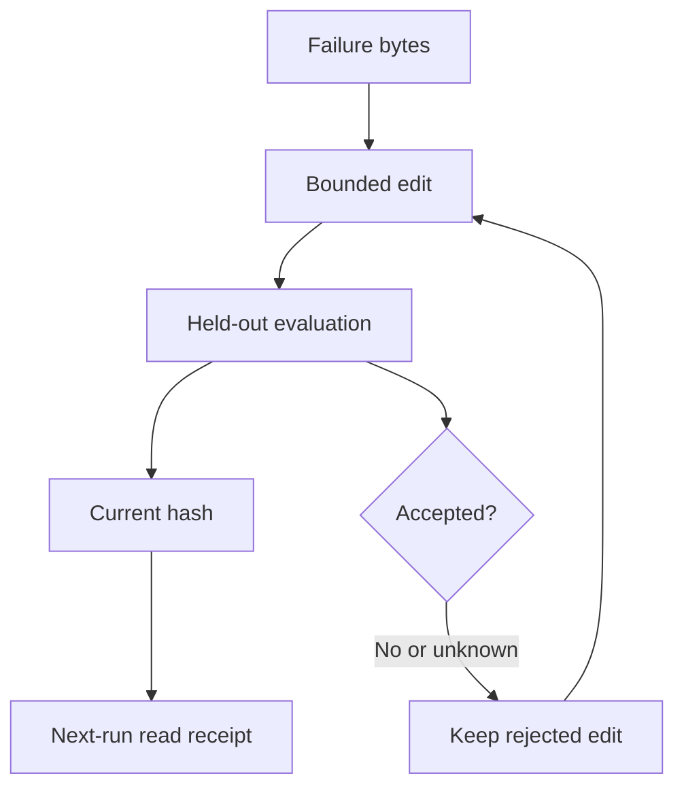

- 現在の入力が`PASS`したことと、過去の失敗が次の実行を変えたことは別です。
- 最低限残すのは、失敗したbytes、1件の限定した編集、保留データの結果、現在のhash、次回のread statusです。
- 固定版SkillOpt-Sleepのmock実験は、保留評価を`0.3333`から`1.0`へ上げ、有害な編集を止めました。
- これは固定されたmockの受入契約のreceiptであり、実運用の品質・収益・知能の向上を測った数字ではありません。

夜間ループのログが`PASS`で終わった。そこで運用を終えると、翌朝に一つだけ分からないことが残ります。昨日の失敗に合わせた変更を、明日の実行が本当に読んだのか。

対象は、夜間に定型調査エージェントを運用し、前夜の修正が翌朝の入力に読まれた証拠を持てない人です。

## PASSだけでは学習を証明できない3つの状態

**書き換え**は、文書や設定のbytesが変わった状態です。変化が起きたことだけを示します。

**現在のPASS**は、現在の入力がチェックを通った状態です。そのbytesに対する今回の判定だけを示します。

**監査できる学習**は、失敗、編集、評価、hash、次回のread receiptを一緒に残した状態です。採用した変更が後の実行へ届いた経路を追えます。

最初の2つしかない段階で、「学習した」と呼ばないことが出発点です。

## 次の実行へのread receiptを証明する5項目

### 1. 失敗したbytesを残す

失敗した入力、質問、評価値、または実行後の測定値を保存します。その判定を生んだ文書や設定のbytesも残します。失敗の分類と、それらを結ぶrun identityを加えます。

入力のない評価値は、何を直すための数字だったかを教えてくれません。入力と出力のhashを同じreceiptに置き、失敗の原文を要約で置き換えないようにします。

### 2. 編集は1件に限定する

追加、削除、置換のどれか1件にします。プロンプト、評価器、データ、ルーターを同じ受入試験で一度に変えません。そうしないと、次の判定がどの変更から生じたのかを記録から切り分けられません。

SkillOptのREADMEは、スキル文書を固定したエージェントの「学習可能な状態」と説明し、保留評価を厳密に改善した候補を受け入れる方法と、却下した編集を残すバッファを説明しています。ここで使う原則は、採否の因果を追える大きさまで編集を狭くすることです。

### 3. 保留データで再評価する

編集のきっかけになった例だけで再試験しません。編集を作るために使わなかった仕事を、採否の境界に残します。

評価器が判定を返さない、または差がノイズと区別できないなら、結果は`unknown`です。却下された編集も境界を知る証拠なので、黙って削除しません。

### 4. hashで記録を結ぶ

次の欄をreceiptの鎖にします。

- `failure`: 失敗の原文、分類、入力hash
- `edit`: 変更対象、変更後のbytes、変更hash
- `evaluation`: 初回と保留評価の結果、タスク版
- `decision`: 採用、却下、または`unknown`と理由
- `consume`: 次回のrun identity、読み込んだ識別子、current hash、read status

現在のbytesとreceiptのhashが一致しないなら、古い`PASS`を新しい文書に貼りません。hashは、どのbytesが評価されたかを固定する境界です。

### 5. 次回のread receiptを必須にする

採用版を台帳へ書くだけでは足りません。次の実行が何を読み込んだかを返します。



read receiptには少なくとも4つ必要です。次回のrun identity、読み込んだファイルや設定の識別子、読み込み時点のcurrent hash、機械判定できるread statusです。評価器がAを通したのに、消費側が古いBを読めば、評価だけPASSして教訓は届きません。

## 固定版mockで確認できた範囲

commit `7da46ae693ee0329b80225c0128a37d65db10e9e`のリポジトリを新しく取得し、公式ドキュメントのコマンドを実行しました。

```text
python3 -m skillopt_sleep.experiments.run_experiment --persona researcher --assert-improves
```

終了コードは0でした。返った主要な値は次のとおりです。

```text
tasks: 12   tokens(approx): 0
baseline held-out : 0.3333
after  held-out   : 1.0   (lift +0.6667)
gate blocks harmful edit: True

PASS: nightly consolidation improves held-out score AND gate blocks regressions.
```

この実験結果から言えるのは、固定したmockの12タスクで保留評価が上がり、有害な編集が拒否されたことです。これは5項目を含む次回のread receiptではありません。実運用の品質、収益、またはエージェントが`0.6667`賢くなったことを示す数字でもありません。

## 記録を持つ費用

費用はhash計算だけでは決まりません。記録の整合性、保留データの境界、次の実行が採用版を読むことを維持する運用が増えます。

- **記録:** failure、edit、evaluation、consumeの4種類を持ちます。失敗の原文と保留データは残します。
- **hash:** 評価対象のbytesと採用版のhashを計算します。この回ではCPU時間や保存容量を測っていません。
- **再評価:** 保留タスクをreplayして判定します。実backendではreplay、judge、reflectionにプロバイダー予算が発生します。固定したmockでは発生しません。
- **運用:** retention、schema変更、欠損検知を決めます。これは初回設定だけで終わらない保守です。

SkillOpt-Sleepの公式ドキュメントは、statefulなnightについて「writes a local `evidence.jsonl`」、mockについて「The mock backend makes no provider calls.」、real backendのdry-runについて「dry-run still incurs provider calls and spend」と記載しています。保存期間も運用者が設定します。したがって、mock結果の`tokens(approx): 0`は実運用の料金ではありません。real backendのプロバイダー予算は導入先で測る運用費として扱います。

小さなループを始める最小案は、記録のschema、保留データ、保存期間、read checkです。API料金、保存容量、実行時間は導入先で測る値で、この研究から補いません。

## 夜間の定型調査で使える範囲

夜間の定型調査のように、保留データと正誤の基準を用意できる仕事で使えます。テストや安定したデータ変換にも同じ条件がある場合だけ広げます。

保留データが汚染されている、評価器が落ちた、毎回の仕事が変わりすぎる、次回のread receiptがない。その場合は`unknown`です。主観的な編集に価値があっても、反復できる採否の境界がなければ、この学習の主張はできません。

繰り返し動くエージェントを運用しているなら、Aniccaの診断入口で、測定可能なreceiptにfailure record、bounded edit、held-out result、current hash、next-run read statusの5項目があるか確認してください。1つでも欠ければ`unknown`と記録します。この記事のmock receiptや収益結果を診断結果として扱ってはいけません。

<!-- canonical-media:start -->


この鎖は、次の実行が返すread receiptで閉じます。


<!-- canonical-media:end -->

## Sources

- [Anicca public landing page](https://aniccaai.com/en)
- [Microsoft SkillOpt README、固定commit](https://github.com/microsoft/SkillOpt/blob/7da46ae693ee0329b80225c0128a37d65db10e9e/README.md)
- [Microsoft SkillOpt-Sleep README、固定commit](https://github.com/microsoft/SkillOpt/blob/7da46ae693ee0329b80225c0128a37d65db10e9e/docs/sleep/README.md)
- [SkillOpt deterministic experiment source、固定commit](https://github.com/microsoft/SkillOpt/blob/7da46ae693ee0329b80225c0128a37d65db10e9e/skillopt_sleep/experiments/run_experiment.py)
- [SkillOpt-Sleep results、固定commit](https://github.com/microsoft/SkillOpt/blob/7da46ae693ee0329b80225c0128a37d65db10e9e/docs/sleep/RESULTS.md)
- [Anicca diagnostic entry point：次回のevidence receiptを確認する](https://aniccaai.com/?product_id=anicca&run_id=20260731-213927&artifact_id=article-ja&variant_id=receipt-chain-ja-v2&click_id=20260731-213927-article-ja-v2)

## さいごに
次の実行が何を読んだかを確認できる記録を、本文の手順として整理しました。
