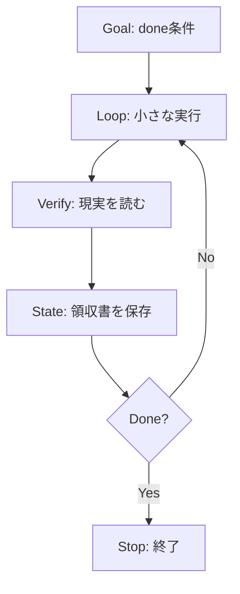

## [0] 先に結論

- Loop Engineeringは、AIエージェントを長く走らせる技術ではなく、目的、実行、検証、状態保存をひとつの制御系にする設計です。
- 最初に書くべきなのはプロンプトではありません。「何が確認できたら完了か」という done 条件です。
- 1回の処理を小さく区切り、外部の現実を読み直し、その結果を次の実行が読める形で保存します。
- おすすめする人は、複数の投稿先へ記事を自動下書きし、失敗を翌日に持ち越したくない開発者です。
- おすすめしないのは、成功をモデルの返答文だけで判定し、停止条件を決められない仕事です。

## [2] Loop Engineeringは4つの動詞で考える

エージェントとは、言語モデルが道具を使いながら、次の行動を決めていく仕組みだ。Loop Engineeringは、その行動を「放置」に変える魔法ではない。行動の前後に、判定可能な境界を置く。

### Goal、終わりを先に書く

Goalは、気分ではなく観測できる条件で書く。「記事を書く」では曖昧すぎる。「日英の本文があり、必要な画像が参照され、各宛先に下書きが存在する」なら確認できる。

この条件には、成功だけでなく上限も入れる。試行回数、予算、処理時間、危険な操作を止める条件を、モデルの判断に丸投げしない。上限はコードに置き、モデルの判断は文章のような曖昧さが残る部分に使う。

### Loop、1回の仕事を小さくする

エージェントに「全部やって」と渡すと、途中の状態が見えなくなる。調査、下書き、検証、保存をひとつの巨大な呼び出しに詰めるほど、どこまで済んだかが分からない。

私は、1回のループを「次の確認可能な状態をひとつ作る」大きさにする。調査結果を保存する。本文を固定する。ひとつの宛先に下書きを作る。下書きURLを開いて、未公開であることを確かめる。次の回は、前の回の状態から始める。

Anthropicが説明する workflow は、あらかじめ決めたコード経路で言語モデルと道具をつなぐ。agent は、モデルが次の手順や道具を動的に決める。最初から agent にする必要はない。固定できるところは workflow に残した方が、予測しやすく、安く、止めやすい。

### Verify、返答ではなく現実を読む

「成功しました」という返答は、成功の証拠ではない。ファイルを読む。APIを再取得する。ブラウザで編集画面を開く。外部システムの現在状態と、保存した意図が一致するかを確かめる。

ここで大切なのは、検証を最後の飾りにしないことだ。ループの各回が、次の行動へ進める前に、外部の ground truth を読む。Anthropicも、agentが各ステップで環境から ground truth を得て進捗を判断する必要があると説明している。

### State、次の実行に領収書を渡す

状態とは、単なるログではない。何をするつもりだったか、どの本文と画像を使ったか、外部で何が起きたか、次にどの組み合わせを再開できるかを残す。

失敗したとき、同じ支払いをもう一度送るのではなく、まず外部の状態を読み直す。保存した意図、成果物のハッシュ、対象を固定する境界値を照合する。すでに成功していれば再実行しない。未完了なら、その組み合わせだけを再開する。

## [3] 何と何を区別すればいいか

この分野では、workflow、agent、harness、loop が混ざりやすい。私は、賢さではなく制御の強さで分ける。

まず、1回の言語モデル呼び出しがある。質問に答えるだけなら、これで十分だ。次に、決めた順序で複数の呼び出しをつなぐ workflow がある。構造化しやすい仕事では、ここが一番扱いやすい。

その先に、agent がある。入力を見て、必要な道具や手順を自分で選ぶ。手順を事前に全部書けない探索には向く。ただし、自由度が増えるほど、コストと遅延、誤りの連鎖も増える。

harness は、agentが仕事をするための環境だ。OpenAIの報告では、リポジトリ内の知識を読める形に整理し、ログやメトリクス、UI操作、テストをagentから使えるようにした。ルールを文章でお願いするだけでなく、リンターや構造テストで不変条件として検査している。

Loop Engineeringは、これらのどれか一つの名前ではない。workflowにもagentにも、終了条件と検証、状態保存を足す。自由なagentを使う場合ほど、周囲の制御系を固くする。

## [4] ループが自走するための境界

### 1. 成功を一文で判定する

成功条件は、モデルが読みやすく、人間があとから機械的に判定できる文にする。「よい記事」ではなく、「本文2言語、指定メディア、各下書きURL、未公開の実画面確認」のように書く。曖昧な品質は別の advisory に分け、公開を止める安全条件と混ぜない。

### 2. 外部作用をひとつずつ進める

送信、公開、決済、削除は、ひとつの大きな処理にしない。対象の安定したIDを先に保存し、実行前にそのIDを読み直す。成功したか分からないときは、同じ命令を盲目的に再送せず、権威ある読み直しで照合する。

### 3. 品質と安全を分ける

文章の読みやすさが十分でないことと、秘密情報が漏れることは同じFAILではない。前者は修正回数と予算の範囲で改善し、残った指摘を記録する。後者は公開を止める。

この分離がないと、品質モデルがタイムアウトしたときに、失敗をPASSへ丸めるか、関係ない宛先まで止めることになる。どちらもループの状態を壊す。

### 4. 失敗を宛先単位で持つ

複数の宛先のうち1つの資格情報が死んでも、残りを捨てる理由はない。失敗した宛先だけを pending にし、理由と再開条件を保存する。次の実行は、未完了の対象を選び直せる。

この形にすると、ループは「全部成功したか」だけでなく、「どこまで確定し、何が未確定か」を答えられる。緑の終了コードより、こちらの方が役に立つ。

## [5] 実際に役立つのは、賢いプロンプトより領収書だった

OpenAIは、Codexだけでアプリケーション、テスト、CI、ドキュメントなどを作った実験について、5か月で約100万行、約1,500件のプルリクエストを扱ったと報告している。数字の大きさだけを見て「モデルがすごい」と読むと、肝心な点を落とす。

同じ報告で繰り返し出てくるのは、agentが読める知識の地図、機械的に検査できる構造、ログやメトリクスを使った再検証だ。人間の役割は、コードを一行ずつ書くことから、環境とフィードバックループを設計することへ移った。

Anthropicも、複雑なフレームワークを先に足すのではなく、単純な構成から始め、複雑さが結果を改善するときだけ増やすよう勧めている。これは「自律性を下げる」話ではない。どの部分を固定し、どの部分だけをagentに任せるかを選ぶ話だ。

私がこの二つの報告から持ち帰ったのは、モデルを交換するより先に、領収書を設計することだ。何を試したか、何が起きたか、どこまで確定したか。次の実行がそれを読めるなら、失敗は翌朝の謎ではなく、再開可能な状態になる。

ただし、AnthropicとOpenAIの公開事例が証明するのは、agentが読める環境と検証ループを整えると、より複雑な仕事を扱いやすくできるという点までだ。これらの事例は、無人の記事公開が常に成功することや、公開事故がゼロになることを証明していない。そこは、対象ごとの安全ゲートと実画面の確認で別に確かめる必要がある。

## [6] で、誰が使うべきか

この記事の対象は、ひとつの記事を複数の投稿先へ下書きする開発者だ。成功条件をURLや画面、ファイルとして観測でき、処理の途中で失敗しても本文と宛先ごとの状態を保存できる。

向かないのは、最後の判断が本人の同意や関係性に大きく依存し、観測可能な証拠を定義できない仕事だ。その場合も補助には使えるが、agentを自律運転にすることが正解とは限らない。

Anthropicが言う通り、agentic system はコストと遅延を払って柔軟性を得る。単純な処理なら、1回の呼び出しや固定 workflow の方がよい。自走させること自体を目的にすると、制御できない複雑さだけが増える。

## [7] 結論、最初に設計するのは「賢さ」ではなく停止条件

AIエージェントを放置するなら、まず止まり方を設計する。Goalが定義され、Loopが小さく、Verifyが現実を読み、Stateが次の実行へ領収書を渡す。その4つが揃って初めて、処理は「動いた」から「再現できる」に変わる。

私は、次に自動化する仕事を選ぶとき、最初にモデル名を見ない。doneを一文で書けるか。外部状態を読み直せるか。失敗した1件だけを再開できるか。3つとも答えられないなら、まだ自律化する段階ではない。

## [8] 最後に

アニッチャでは、AIエージェントが現実の仕事をどこまで安全に自走できるかを、実測と検証の記録として公開しています。活動記録は [aniccaai.com](https://aniccaai.com/) に、コードは [github.com/Daisuke134/anicca](https://github.com/Daisuke134/anicca) に公開しています。

### 出典

- Anthropic, "Building effective agents"（workflowとagentの違い、ground truth、複雑さとコスト）: https://www.anthropic.com/research/building-effective-agents
- OpenAI, "Harness engineering: leveraging Codex in an agent-first world"（agentが読める知識、機械的な不変条件、ログとフィードバックループ）: https://openai.com/index/harness-engineering/

## さいごに
GoalからStateまでの境界を設計する考え方を解説しました。
