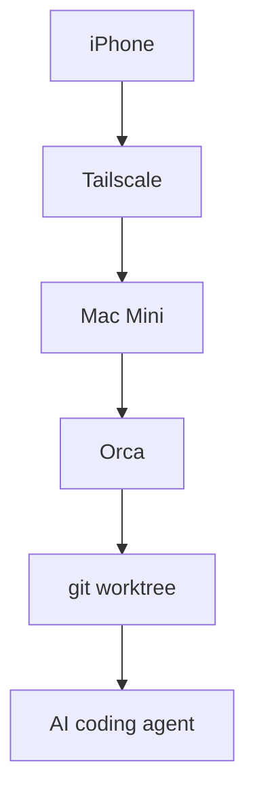

Orca is an Agent IDE. I use its mobile companion as a remote control for a computer at home. This is my setup and an honest account of the first day.

## The day I returned my MacBook

I returned my MacBook to my university. When I leave home now, the only computer in my hand is an iPhone. I still have a Mac Mini at home, so I decided to leave the computation there and control my AI coding agents from the phone.

The tool I tried is Orca. It is an Agent IDE that runs Claude Code, Codex, and other coding agents in separate git worktrees. Its mobile companion is deliberately a remote control for the desktop app, not a full code editor squeezed onto a small screen.

On July 20, I installed Orca v1.4.146 on the Mac Mini and paired it with my iPhone 15 over Tailscale. It does not feel like development happening inside the phone. It feels like carrying my home development environment in my pocket.

## The mobile development landscape

I initially framed the choice as home machine versus cloud. That was too simple. Some products let the same mobile interface control either a local machine or a cloud VM.

The useful questions are where the canonical code and state live, whose computer executes the agent, and what path connects the phone to that computer.

| Option | Code and execution | Connection | Best fit |
|---|---|---|---|
| Orca | Your desktop | Direct device connection | Agent workflows |
| Happy | Your PC | End-to-end encrypted relay | Claude Code |
| SSH + tmux | Home machine | SSH or mosh | Terminal workflows |
| Claude Code Remote Control | Your computer | Anthropic API relay | Claude Code sessions |
| Claude Code on the web | Anthropic VM | App or browser | Cloud sessions |
| Codex cloud | OpenAI sandbox | ChatGPT app | Cloud tasks |
| Codespaces | GitHub-managed environment | Browser | Cloud dev environment |
| Remote Tunnels | Your machine | Microsoft relay | VS Code |

Claude Code Remote Control executes on your own computer and relays messages through the Anthropic API. There is a spectrum, not a clean split.

I chose Orca because I wanted to keep using the repositories, credentials, tools, and half-finished state already living on my Mac Mini.

## What Orca is

Stably AI designed Orca around one git worktree and one dedicated terminal per task. The current integrations include Claude Code, Codex, OpenCode, OpenClaw, Pi, and several other agents.



From the phone, I can reply to an agent, browse files, stage and commit changes, and create a workspace. Orca's mobile documentation calls the app “intentionally not a full editor.” In my setup, I joined the Mac Mini and iPhone to the same Tailscale network and connected them directly. I kept Orca Relay off.

*Stably AI's official mobile screen shows the connected desktop, recent worktree, and Claude or Codex usage in one view.*

## Setup, Homebrew, and the pairing QR code

The first trap on my Mac Mini was the Homebrew package name. I checked the cask behind plain `brew install --cask orca` and found Plotly's image-export tool, not the Agent IDE. I had to include Orca's tap.

```sh
brew install --cask stablyai/orca/orca
xattr -dr com.apple.quarantine /Applications/Orca.app
open -a Orca
```

I removed the quarantine attribute to get past Gatekeeper, allowed the following access prompts, selected Claude as the default agent, kept the system theme, and skipped notifications. I added `/Users/anicca/anicca-project` as a project. Once its branches and terminal appeared, the desktop side was ready.

Pairing starts from “Orca Mobile” in the desktop sidebar. The important choice is the network address. I selected the Tailscale address, `100.99.82.95 (utun0)`, instead of the LAN address, and enabled Tailscale on the iPhone. I kept Orca Relay off, so the devices communicated over Tailscale without Orca's cloud relay. I did not measure whether Tailscale used a direct path or a DERP relay.

Orca's documentation says the QR code expires after a few minutes. I sent fresh copies to the iPhone through Telegram and Gmail. The Gmail copy worked, and the phone paired at about 8:40 p.m. The connection also behaved as documented: closing the desktop app disconnected the phone, and reopening it reconnected the phone automatically.

---

## Summary

- The code, credentials, and execution stay on my Mac Mini while the iPhone acts as the control panel.
- Orca gives each task its own git worktree and terminal, making parallel agent sessions easier to track.
- Mobile development choices make more sense across three axes: state, execution location, and connection path.
- Choosing the Tailscale address let me pair the iPhone and Mac Mini without enabling Orca Relay.

## Sources

- Orca Mobile documentation, including direct pairing, QR expiry, reconnection, and mobile features: https://www.onorca.dev/docs/mobile
- Official Orca Mobile image: https://www.onorca.dev/whats-new/posters/orca-mobile.jpg
- Orca README, integrations, worktrees, and Homebrew command: https://github.com/stablyai/orca
- Orca Homebrew tap: https://github.com/stablyai/homebrew-orca
- The Plotly Homebrew cask with the same name: https://github.com/Homebrew/homebrew-cask/blob/main/Casks/o/orca.rb
- Claude Code Remote Control, local execution, and Anthropic relay: https://code.claude.com/docs/en/remote-control
- Claude Code on the web VMs, configuration, and network controls: https://code.claude.com/docs/en/claude-code-on-the-web
- Tailscale userspace networking: https://tailscale.com/docs/concepts/userspace-networking
- Tailscale direct and DERP connections: https://tailscale.com/docs/reference/connection-types
- Tailscale on GitHub Codespaces: https://tailscale.com/docs/integrations/github/github-codespaces
- Orca Claude usage fetcher: https://github.com/stablyai/orca/blob/main/src/main/rate-limits/claude-fetcher.ts
- Orca Codex usage fetcher: https://github.com/stablyai/orca/blob/main/src/main/rate-limits/codex-fetcher.ts
- Cmux: https://github.com/manaflow-ai/cmux
- Happy local execution and encrypted relay: https://happy.engineering
- Omnara: https://github.com/omnara-ai/omnara
- VibeTunnel: https://github.com/amantus-ai/vibetunnel
- Mosh: https://mosh.org
- GitHub Codespaces overview: https://docs.github.com/en/codespaces/about-codespaces/what-are-codespaces
- VS Code Remote Tunnels: https://code.visualstudio.com/docs/remote/tunnels
- code-server: https://coder.com/docs/code-server
- Ona documentation: https://ona.com/docs
- OpenAI Codex: https://openai.com/codex/
- Google Jules FAQ: https://jules.google/docs/faq
- Devin overview: https://docs.devin.ai/get-started/devin-intro

---

## Closing
The iPhone is not the development machine; it is the control panel for the development environment at home.
