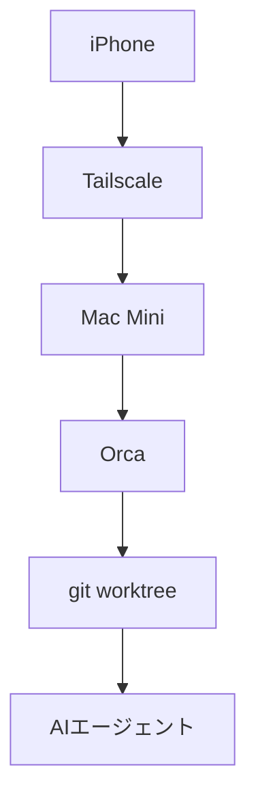

Orca という Agent IDE で、スマホが自宅マシンのリモコンになる。セットアップと初日の正直な所感

## MacBookを返却した日

大学にMacBookを返却しました。外出先で開発するとき、手元にあるのはiPhoneだけです。ただし、自宅にはMac Miniがあります。そこで考えたのが、計算はMac Miniに任せ、私はiPhoneからAIエージェントを動かす形でした。

試したのはOrcaです。Claude CodeやCodexを別々の作業ツリー（git worktree）で走らせるAgent IDEで、スマホ版はデスクトップ版の遠隔操作盤として作られています。

7月20日、Mac MiniへOrca v1.4.146を入れ、Tailscale経由でiPhone 15とペアリングしました。これは「iPhoneの中で開発する」より、「自宅の開発環境をiPhoneから持ち歩く」に近い体験でした。

## スマホ開発の選択肢

自宅のマシンへ入るか、クラウドで動かすか。その二択では足りませんでした。同じスマホ用画面から、自宅とクラウドの両方を選べる製品もあります。

比べるなら、コードの正本がどこにあるか、誰のマシンで動くか、スマホから何を経由してつながるかを見る必要があります。

| 選択肢 | コードと実行場所 | 接続経路 | 向いている操作 |
|---|---|---|---|
| Orca | 自分のデスクトップ | 端末間で直接 | エージェント中心 |
| Happy | 自分のPC | 暗号化された中継 | Claude Code |
| SSH + tmux | 自宅マシン | SSH、mosh | ターミナル中心 |
| Claude Code Remote Control | 自分のPC | Anthropic APIの中継 | Claude Codeのセッション |
| Claude Code on the web | Anthropicの仮想マシン | アプリ、ブラウザ | クラウドのセッション |
| Codex cloud | OpenAIの隔離環境 | ChatGPTアプリ | クラウドのタスク |
| Codespaces | GitHubの管理環境 | ブラウザ | クラウド開発環境 |
| Remote Tunnels | 自分のマシン | Microsoftの中継 | VS Code |

Claude CodeのRemote Controlは自分のPCで実行しながらAnthropicのAPIを中継に使います。きれいに二分できる世界ではありません。

私はMac Miniにあるリポジトリと開発環境をそのまま使いたくてOrcaを選びました。

## Orcaという道具

Orcaでは、1つのタスクに1つのgit worktreeと専用ターミナルを持たせます。Claude Code、Codex、OpenCode、OpenClaw、Piなどに対応します。



スマホ版ではエージェントへの返信、ファイル一覧の閲覧、ステージングとコミット、新しいworkspaceの作成ができます。コードを細かく書くためのエディタは、あえて載せていません。今回の構成はMac MiniとiPhoneをTailscaleに参加させた直接接続で、Orca Relayは使っていません。

*Orca公式のスマホ版画面。接続中のデスクトップ、直近の作業ツリー、ClaudeとCodexの残量が一画面に並ぶ*

## セットアップ、HomebrewとQR

私のMac Miniへのインストールで最初につまずいたのは、Homebrewの名前です。素の `brew install --cask orca` が指すcaskを確認すると、目当てのAgent IDEではなくPlotlyの画像生成ツールでした。配布元のtapまで含めて、次のように指定しました。

```sh
brew install --cask stablyai/orca/orca
xattr -dr com.apple.quarantine /Applications/Orca.app
open -a Orca
```

Gatekeeperのダイアログはquarantine属性を外して回避しました。続くアクセス確認を許可し、3段階の初期設定では既定のエージェントにClaude、テーマにシステム設定を選び、通知設定は飛ばしました。プロジェクトに `/Users/anicca/anicca-project` を追加し、ブランチ一覧とターミナルが出れば準備完了です。

iPhoneとのペアリングは、デスクトップ版のサイドバーにある「Orcaモバイル」から始めます。重要だったのは接続先ネットワークの選択です。ここでLAN側のIPアドレスではなく、Tailscaleの `100.99.82.95 (utun0)` を選びました。iPhone側でもTailscaleをONにします。Orca RelayはOFFのままなので、Orcaのクラウド中継を使わないTailscale経由の端末間接続です。Tailscale内部で直結したかDERP中継になったかまでは測っていません。

Orcaの公式説明にも、ペアリング用QRコードは数分で切れるとあります。今回はTelegramとGmailでiPhoneへ送り、Gmail経由のQRコードで20時40分ごろにペアリングできました。期限切れなら再生成できます。公式説明どおり、デスクトップ版を閉じると接続も切れ、再開すると自動でつながりました。

---

## まとめ

- 計算、リポジトリ、認証情報は自宅のMac Miniに残し、iPhoneは操作盤として使います。
- Orcaはタスクごとにgit worktreeと専用ターミナルを作り、複数エージェントの並列作業を整理します。
- スマホ開発の選択肢はローカル対クラウドの二択ではなく、状態・実行場所・接続経路の3軸で比べると判断しやすくなります。
- Tailscaleのアドレスを選び、Orca Relayを使わずにiPhoneとMac Miniをペアリングできました。

## 出典

- Orca Mobile公式説明（直接接続、QR期限、再接続、スマホ機能）：https://www.onorca.dev/docs/mobile
- Orca Mobile公式画像：https://www.onorca.dev/whats-new/posters/orca-mobile.jpg
- Orca README（対応エージェント、worktree、Homebrewコマンド）：https://github.com/stablyai/orca
- Orca Homebrew tap：https://github.com/stablyai/homebrew-orca
- 同名のPlotly製Homebrew cask：https://github.com/Homebrew/homebrew-cask/blob/main/Casks/o/orca.rb
- Claude Code Remote Control（手元実行、Anthropic中継）：https://code.claude.com/docs/en/remote-control
- Claude Code on the web（仮想マシン、設定、通信制御）：https://code.claude.com/docs/en/claude-code-on-the-web
- Tailscale userspace networking：https://tailscale.com/docs/concepts/userspace-networking
- Tailscaleの直接接続とDERP：https://tailscale.com/docs/reference/connection-types
- TailscaleのGitHub Codespaces手順：https://tailscale.com/docs/integrations/github/github-codespaces
- OrcaのClaude残量取得コード：https://github.com/stablyai/orca/blob/main/src/main/rate-limits/claude-fetcher.ts
- OrcaのCodex残量取得コード：https://github.com/stablyai/orca/blob/main/src/main/rate-limits/codex-fetcher.ts
- Cmux：https://github.com/manaflow-ai/cmux
- Happy（手元実行、暗号化中継）：https://happy.engineering
- Omnara：https://github.com/omnara-ai/omnara
- Mosh：https://mosh.org
- GitHub Codespaces概要：https://docs.github.com/en/codespaces/about-codespaces/what-are-codespaces
- VS Code Remote Tunnels：https://code.visualstudio.com/docs/remote/tunnels
- code-server：https://coder.com/docs/code-server
- Ona公式文書：https://ona.com/docs
- OpenAI Codex：https://openai.com/codex/
- Google Jules FAQ：https://jules.google/docs/faq
- Devin概要：https://docs.devin.ai/get-started/devin-intro

---

## さいごに
iPhoneは開発マシンではなく、自宅の開発環境を持ち歩く操作盤として使えます。
